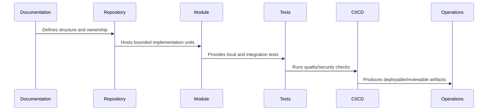

# Frontend and Client Module Structure

> *"Defines frontend/client module structure for routes/pages, components, state, API clients, schemas, hooks, feature modules, tests, and UI boundaries."*

---

# Purpose

Defines frontend/client module structure for routes/pages, components, state, API clients, schemas, hooks, feature modules, tests, and UI boundaries.

---

# Implementation Problem

Frontend complexity grows fast when API calls, business rules, permissions, and UI rendering are mixed together.

---

# Implementation Decision

## Decision

CLARA frontend/client implementation should keep UI, state, API contracts, validation, and feature logic separated enough to remain maintainable.

## Status

Accepted.

---

# Repository Implementation Rule

Every CLARA folder, package, and module should answer:

```text
what it owns
who owns it
what depends on it
what it may import
what it must not import
how it is tested
how it is deployed or consumed
what security boundary it touches
```

A repository structure is not production-ready if:

```text
ownership is unclear
deployable code and shared code are mixed randomly
security-sensitive code has no obvious owner
tests are hard to locate
environment files are inconsistent
AI assistants cannot infer safe boundaries
CI/CD cannot target modules cleanly
```

---

# Recommended Repository Flow



---

# Production-Ready Checklist

- [ ] Folder has clear purpose.
- [ ] Owner is clear.
- [ ] Import direction is clear.
- [ ] Tests are discoverable.
- [ ] Public interface is clear where relevant.
- [ ] Security-sensitive files are protected.
- [ ] Config/secrets rules are documented.
- [ ] CI/CD can target the folder.
- [ ] AI assistant guidance exists where needed.
- [ ] Documentation links to related architecture/security/operations docs.

---

# Acceptance Criteria

- [ ] Repository structure is understandable.
- [ ] Module boundaries are explicit.
- [ ] Shared code has ownership.
- [ ] Tests and tooling are discoverable.
- [ ] Security risks are reduced by structure.
- [ ] Future implementation can proceed safely.

---

# Anti-patterns

Avoid:

- `utils/` becoming a dumping ground.
- Controllers owning business logic.
- UI components calling random internal services directly.
- Shared packages depending on deployable apps.
- Worker jobs mutating data without idempotency.
- Scripts that can accidentally target production.
- Multiple competing environment conventions.
- Tests hidden beside unrelated code with no pattern.
- AI assistant instructions only in chat history, not repository files.
- Committing generated artifacts without reason.

---

# Related Documents

- ../PART-01-Implementation-Foundation/README.md
- ../../BOOK-07-Operations-Observability-and-Reliability/BOOK-07-Master-Index/README.md
- ../../BOOK-06-Security-Governance-and-Compliance/BOOK-06-Master-Index/README.md
- ../../BOOK-04-Data-API-AI-and-Integration-Design/README.md
- ../../BOOK-03-Architecture-and-Engineering/README.md

---

# Navigation

**Previous:** `18-Backend-Module-Structure.md`

**Next:** `20-Worker-and-Async-Module-Structure.md`

---

# Frontend Module Structure

Recommended feature module pattern:

```text
apps/web/src/features/<feature-name>/
├── components/
├── pages/
├── hooks/
├── state/
├── api/
├── schemas/
├── utils/
├── tests/
└── index.ts
```

---

# Frontend Layer Rules

```text
components render UI
hooks orchestrate UI behavior
api clients call backend contracts
schemas validate external/client boundary data where useful
state stores client state only
feature modules own feature-specific UI
shared UI belongs in packages/ui
```

---

# Client Security Rules

```text
do not trust client-side authorization
do not store secrets in frontend
sanitize/render user content safely
avoid leaking tokens in logs/errors
handle permission-denied states clearly
```

---

# UX Rule

Frontend should show loading, empty, error, permission-denied, and degraded states intentionally.
