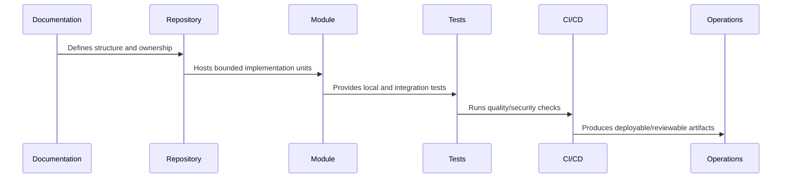

# Scripts Tooling and Automation

> *"Defines repository scripts, developer tooling, code generation boundaries, safe automation, linting, formatting, validation scripts, and AI assistant helper files."*

---

# Purpose

Defines repository scripts, developer tooling, code generation boundaries, safe automation, linting, formatting, validation scripts, and AI assistant helper files.

---

# Implementation Problem

Unsafe scripts can damage local data, leak secrets, or mutate production if guardrails are missing.

---

# Implementation Decision

## Decision

CLARA scripts and tooling should automate repeatable safe tasks while preventing destructive or security-sensitive operations from becoming accidental commands.

## Status

Accepted.

---

# Repository Implementation Rule

Every CLARA folder, package, and module should answer:

```text
what it owns
who owns it
what depends on it
what it may import
what it must not import
how it is tested
how it is deployed or consumed
what security boundary it touches
```

A repository structure is not production-ready if:

```text
ownership is unclear
deployable code and shared code are mixed randomly
security-sensitive code has no obvious owner
tests are hard to locate
environment files are inconsistent
AI assistants cannot infer safe boundaries
CI/CD cannot target modules cleanly
```

---

# Recommended Repository Flow



---

# Production-Ready Checklist

- [ ] Folder has clear purpose.
- [ ] Owner is clear.
- [ ] Import direction is clear.
- [ ] Tests are discoverable.
- [ ] Public interface is clear where relevant.
- [ ] Security-sensitive files are protected.
- [ ] Config/secrets rules are documented.
- [ ] CI/CD can target the folder.
- [ ] AI assistant guidance exists where needed.
- [ ] Documentation links to related architecture/security/operations docs.

---

# Acceptance Criteria

- [ ] Repository structure is understandable.
- [ ] Module boundaries are explicit.
- [ ] Shared code has ownership.
- [ ] Tests and tooling are discoverable.
- [ ] Security risks are reduced by structure.
- [ ] Future implementation can proceed safely.

---

# Anti-patterns

Avoid:

- `utils/` becoming a dumping ground.
- Controllers owning business logic.
- UI components calling random internal services directly.
- Shared packages depending on deployable apps.
- Worker jobs mutating data without idempotency.
- Scripts that can accidentally target production.
- Multiple competing environment conventions.
- Tests hidden beside unrelated code with no pattern.
- AI assistant instructions only in chat history, not repository files.
- Committing generated artifacts without reason.

---

# Related Documents

- ../PART-01-Implementation-Foundation/README.md
- ../../BOOK-07-Operations-Observability-and-Reliability/BOOK-07-Master-Index/README.md
- ../../BOOK-06-Security-Governance-and-Compliance/BOOK-06-Master-Index/README.md
- ../../BOOK-04-Data-API-AI-and-Integration-Design/README.md
- ../../BOOK-03-Architecture-and-Engineering/README.md

---

# Navigation

**Previous:** `22-Testing-Folder-Structure.md`

**Next:** `24-Part-02-Summary.md`

---

# Scripts Layout

```text
scripts/
├── dev/
├── db/
├── test/
├── lint/
├── security/
├── ci/
├── release/
└── README.md
```

---

# Safe Script Rules

Scripts should:

```text
print what they do
fail fast
avoid production by default
require explicit environment confirmation for risky actions
never echo secrets
support dry-run where risky
be documented
```

---

# Recommended Commands

```bash
pnpm dev
pnpm build
pnpm test
pnpm test:integration
pnpm lint
pnpm format
pnpm typecheck
pnpm security:check
pnpm db:migrate
pnpm db:seed
```

---

# AI Assistant Tooling

Repository should include:

```text
AGENTS.md
module-level AGENTS.md where needed
docs index links
safe command list
forbidden action list
test command list
```

---

# Automation Rule

Automation should reduce toil without reducing safety.
