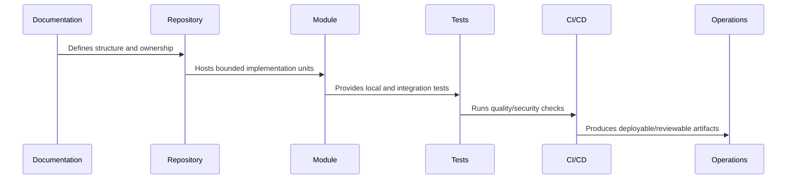

# Part 02 Summary

> *"Summarizes Repository and Module Implementation and prepares for Book VIII Part 03."*

---

# Purpose

Summarizes Repository and Module Implementation and prepares for Book VIII Part 03.

---

# Implementation Problem

Backend Implementation comes next because the repository boundaries are now ready to host production-grade API, domain, data, auth, AI, and integration logic.

---

# Implementation Decision

## Decision

CLARA should proceed to Backend Implementation after defining repository skeleton, root docs, workspace strategy, layouts, module structures, shared packages, tests, scripts, and tooling.

## Status

Accepted.

---

# Repository Implementation Rule

Every CLARA folder, package, and module should answer:

```text
what it owns
who owns it
what depends on it
what it may import
what it must not import
how it is tested
how it is deployed or consumed
what security boundary it touches
```

A repository structure is not production-ready if:

```text
ownership is unclear
deployable code and shared code are mixed randomly
security-sensitive code has no obvious owner
tests are hard to locate
environment files are inconsistent
AI assistants cannot infer safe boundaries
CI/CD cannot target modules cleanly
```

---

# Recommended Repository Flow



---

# Production-Ready Checklist

- [ ] Folder has clear purpose.
- [ ] Owner is clear.
- [ ] Import direction is clear.
- [ ] Tests are discoverable.
- [ ] Public interface is clear where relevant.
- [ ] Security-sensitive files are protected.
- [ ] Config/secrets rules are documented.
- [ ] CI/CD can target the folder.
- [ ] AI assistant guidance exists where needed.
- [ ] Documentation links to related architecture/security/operations docs.

---

# Acceptance Criteria

- [ ] Repository structure is understandable.
- [ ] Module boundaries are explicit.
- [ ] Shared code has ownership.
- [ ] Tests and tooling are discoverable.
- [ ] Security risks are reduced by structure.
- [ ] Future implementation can proceed safely.

---

# Anti-patterns

Avoid:

- `utils/` becoming a dumping ground.
- Controllers owning business logic.
- UI components calling random internal services directly.
- Shared packages depending on deployable apps.
- Worker jobs mutating data without idempotency.
- Scripts that can accidentally target production.
- Multiple competing environment conventions.
- Tests hidden beside unrelated code with no pattern.
- AI assistant instructions only in chat history, not repository files.
- Committing generated artifacts without reason.

---

# Related Documents

- ../PART-01-Implementation-Foundation/README.md
- ../../BOOK-07-Operations-Observability-and-Reliability/BOOK-07-Master-Index/README.md
- ../../BOOK-06-Security-Governance-and-Compliance/BOOK-06-Master-Index/README.md
- ../../BOOK-04-Data-API-AI-and-Integration-Design/README.md
- ../../BOOK-03-Architecture-and-Engineering/README.md

---

# Navigation

**Previous:** `23-Scripts-Tooling-and-Automation.md`

**Next:** `../PART-03-Backend-Implementation/README.md`

---

# Part 02 Completion

Part 02 establishes:

- Repository and module implementation overview.
- Root repository skeleton.
- Root documentation files.
- Workspace and package strategy.
- Apps/services/packages layout.
- Backend module structure.
- Frontend/client module structure.
- Worker/async module structure.
- Shared packages and libraries.
- Testing folder structure.
- Scripts, tooling, and automation.

---

# Ready for Part 03

The next part should be:

```text
BOOK VIII — PART 03: Backend Implementation
```

It should define:

- Backend implementation overview.
- API service bootstrap.
- Routing/controller standards.
- Validation and DTO standards.
- Application service standards.
- Domain logic standards.
- Repository/data access standards.
- Authentication and authorization implementation.
- Error handling and response standards.
- Backend observability.
- Backend testing standards.
