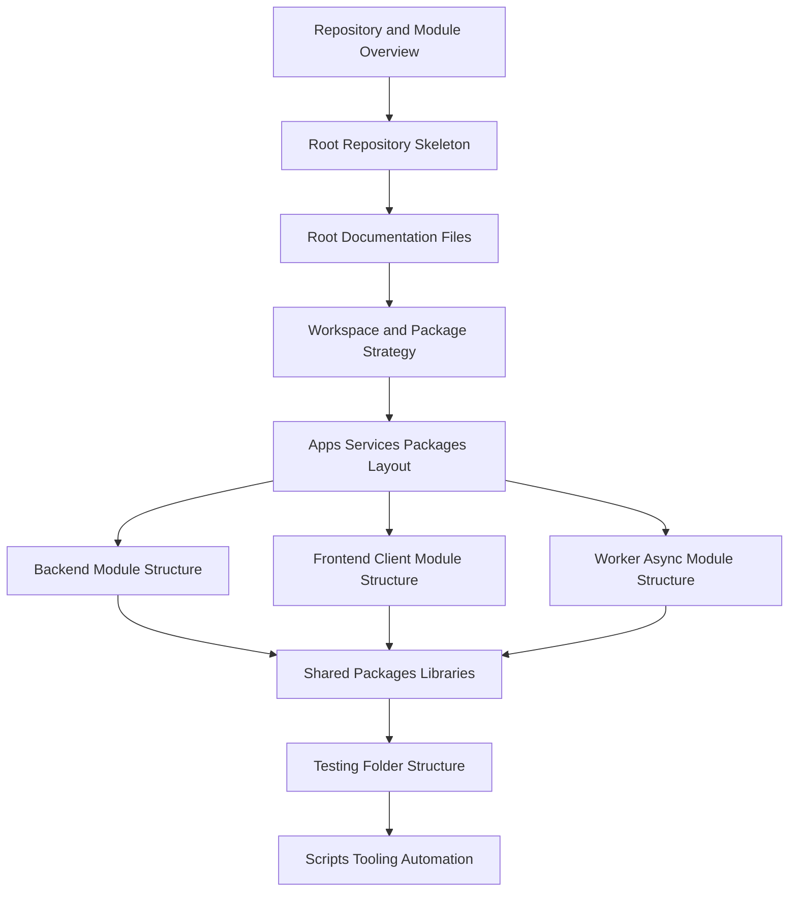

# PART-02 — Repository and Module Implementation

> *"A good repository is not just folders. It is an operating agreement for how the system grows."*

---

# Purpose

Part 02 defines CLARA's repository and module implementation model.

It converts the implementation foundation into a concrete repository structure for:

- root skeleton
- root documentation
- workspace/package strategy
- apps/services/packages layout
- backend module structure
- frontend/client module structure
- worker/async module structure
- shared packages
- testing structure
- scripts/tooling/automation

---

# Chapter Map

| Chapter | Title |
|---:|---|
| 13 | Repository and Module Implementation Overview |
| 14 | Root Repository Skeleton |
| 15 | Root Documentation Files |
| 16 | Workspace and Package Strategy |
| 17 | Apps Services and Packages Layout |
| 18 | Backend Module Structure |
| 19 | Frontend and Client Module Structure |
| 20 | Worker and Async Module Structure |
| 21 | Shared Packages and Libraries |
| 22 | Testing Folder Structure |
| 23 | Scripts Tooling and Automation |
| 24 | Part 02 Summary |

---

# Repository Implementation Map



---

# Repository Non-Negotiables

CLARA repository implementation must enforce:

```text
clear root structure
docs-first navigation
module boundaries
workspace consistency
owned shared packages
secure default configs
no committed secrets
test folder clarity
automation guardrails
AI assistant guidance
CI/CD compatibility
production ownership alignment
```

---

# Relationship to Part 01

Part 01 defines implementation foundation.

Part 02 defines the repository and module structure that turns that foundation into actual implementation space.

---

# Navigation

**Previous:** `../PART-01-Implementation-Foundation/12-Part-01-Summary.md`

**Next:** `13-Repository-and-Module-Implementation-Overview.md`
