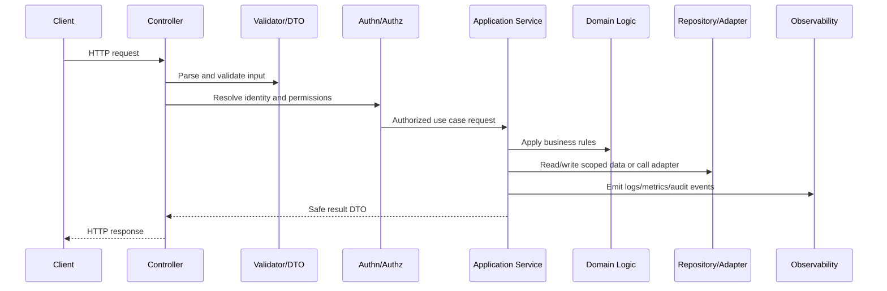

# API Service Bootstrap

> *"Defines backend API bootstrap standards including runtime initialization, configuration loading, dependency wiring, health checks, graceful shutdown, and startup validation."*

---

# Purpose

Defines backend API bootstrap standards including runtime initialization, configuration loading, dependency wiring, health checks, graceful shutdown, and startup validation.

---

# Backend Problem

A backend service that starts with missing config or exits unsafely can create outages and confusing deployments.

---

# Backend Decision

## Decision

CLARA API services should bootstrap predictably with validated configuration, safe defaults, health endpoints, dependency readiness checks, and graceful shutdown behavior.

## Status

Accepted.

---

# Backend Implementation Rule

Every backend capability should be implemented as:

```text
Route/Controller -> Validation DTO -> Authentication Context -> Authorization Policy -> Application Service -> Domain Logic -> Repository/Adapter -> Observability -> Tests
```

A backend change is not production-ready if it cannot answer:

```text
what input is accepted
how input is validated
who is authenticated
what authorization is enforced
what business rule is applied
what data is accessed
how tenant/workspace scope is enforced
what error is returned
what is logged/measured
what tests prove the behavior
```

---

# Recommended Backend Flow



---

# Production-Ready Checklist

- [ ] Boundary validation exists.
- [ ] DTOs are explicit.
- [ ] Authentication context is resolved safely.
- [ ] Authorization policy is enforced.
- [ ] Business logic is testable.
- [ ] Data access is scoped.
- [ ] External calls have timeout/failure handling.
- [ ] Errors are safe and consistent.
- [ ] Logs/metrics/audit events are safe.
- [ ] Unit/integration/security tests exist.

---

# Acceptance Criteria

- [ ] Backend layer responsibility is clear.
- [ ] Security controls are explicit.
- [ ] Data boundaries are protected.
- [ ] Error and observability behavior is defined.
- [ ] Testing expectations are clear.
- [ ] AI coding assistants can apply this safely.

---

# Anti-patterns

Avoid:

- Fat controllers.
- Business logic inside database queries only.
- Repository methods that skip tenant/workspace scope.
- Authorization only in frontend.
- Returning raw database entities.
- Logging full request bodies by default.
- Throwing raw provider/database errors to clients.
- Retrying unsafe mutations.
- Tests that only cover happy paths.
- Adding endpoints without observability.

---

# Related Documents

- ../PART-01-Implementation-Foundation/README.md
- ../PART-02-Repository-and-Module-Implementation/README.md
- ../../BOOK-06-Security-Governance-and-Compliance/BOOK-06-Master-Index/README.md
- ../../BOOK-07-Operations-Observability-and-Reliability/BOOK-07-Master-Index/README.md
- ../../BOOK-04-Data-API-AI-and-Integration-Design/README.md

---

# Navigation

**Previous:** `25-Backend-Implementation-Overview.md`

**Next:** `27-Routing-and-Controller-Standards.md`

---

# API Bootstrap Responsibilities

API bootstrap should:

```text
load config
validate config
initialize logger
initialize telemetry
initialize database connection
initialize queue/provider clients where needed
register routes/plugins/middleware
register health/readiness endpoints
handle graceful shutdown
start server
```

---

# Startup Validation Checklist

- [ ] Required environment variables exist.
- [ ] Secrets are loaded from approved source.
- [ ] Runtime version is compatible.
- [ ] Database connection can initialize.
- [ ] Migrations state is compatible where checked.
- [ ] Logger and telemetry are initialized.
- [ ] Critical dependencies are checked or marked degraded.
- [ ] Service fails fast on unsafe missing config.

---

# Health Endpoint Model

```text
/livez  = process is alive
/readyz = service is ready to receive traffic
/health = operational health summary, protected or carefully scoped
```

---

# Shutdown Rule

Production services should stop accepting new work before closing database, queue, and provider clients.
