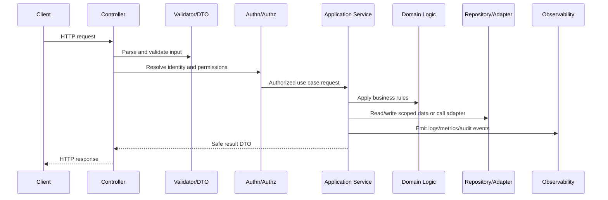

# Routing and Controller Standards

> *"Defines routing and controller implementation standards for HTTP boundaries, request parsing, response mapping, status codes, pagination, and controller responsibilities."*

---

# Purpose

Defines routing and controller implementation standards for HTTP boundaries, request parsing, response mapping, status codes, pagination, and controller responsibilities.

---

# Backend Problem

Controllers become hard to maintain when they contain business rules, database queries, or provider-specific logic.

---

# Backend Decision

## Decision

CLARA controllers should be thin boundaries that validate request context, delegate to application services, and return safe response DTOs.

## Status

Accepted.

---

# Backend Implementation Rule

Every backend capability should be implemented as:

```text
Route/Controller -> Validation DTO -> Authentication Context -> Authorization Policy -> Application Service -> Domain Logic -> Repository/Adapter -> Observability -> Tests
```

A backend change is not production-ready if it cannot answer:

```text
what input is accepted
how input is validated
who is authenticated
what authorization is enforced
what business rule is applied
what data is accessed
how tenant/workspace scope is enforced
what error is returned
what is logged/measured
what tests prove the behavior
```

---

# Recommended Backend Flow



---

# Production-Ready Checklist

- [ ] Boundary validation exists.
- [ ] DTOs are explicit.
- [ ] Authentication context is resolved safely.
- [ ] Authorization policy is enforced.
- [ ] Business logic is testable.
- [ ] Data access is scoped.
- [ ] External calls have timeout/failure handling.
- [ ] Errors are safe and consistent.
- [ ] Logs/metrics/audit events are safe.
- [ ] Unit/integration/security tests exist.

---

# Acceptance Criteria

- [ ] Backend layer responsibility is clear.
- [ ] Security controls are explicit.
- [ ] Data boundaries are protected.
- [ ] Error and observability behavior is defined.
- [ ] Testing expectations are clear.
- [ ] AI coding assistants can apply this safely.

---

# Anti-patterns

Avoid:

- Fat controllers.
- Business logic inside database queries only.
- Repository methods that skip tenant/workspace scope.
- Authorization only in frontend.
- Returning raw database entities.
- Logging full request bodies by default.
- Throwing raw provider/database errors to clients.
- Retrying unsafe mutations.
- Tests that only cover happy paths.
- Adding endpoints without observability.

---

# Related Documents

- ../PART-01-Implementation-Foundation/README.md
- ../PART-02-Repository-and-Module-Implementation/README.md
- ../../BOOK-06-Security-Governance-and-Compliance/BOOK-06-Master-Index/README.md
- ../../BOOK-07-Operations-Observability-and-Reliability/BOOK-07-Master-Index/README.md
- ../../BOOK-04-Data-API-AI-and-Integration-Design/README.md

---

# Navigation

**Previous:** `26-API-Service-Bootstrap.md`

**Next:** `28-Validation-and-DTO-Standards.md`

---

# Controller Responsibilities

Controllers should:

```text
extract request context
call validators/parsers
resolve authenticated actor
call application service
map service result to response DTO
map known errors to safe HTTP response
emit boundary-level telemetry where useful
```

Controllers should not:

```text
contain business rules
query database directly
call provider APIs directly
perform complex authorization logic inline
return raw entities
```

---

# HTTP Response Standards

Use consistent status codes:

```text
200 OK
201 Created
202 Accepted
204 No Content
400 Bad Request
401 Unauthorized
403 Forbidden
404 Not Found
409 Conflict
422 Unprocessable Entity
429 Too Many Requests
500 Internal Server Error
503 Service Unavailable
```

---

# Pagination Rule

List endpoints must be bounded.

Use cursor pagination or explicit limit/offset strategy based on data shape.
