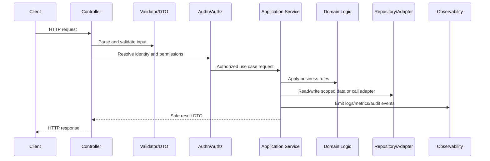

# Application Service Standards

> *"Defines application service responsibilities, use case orchestration, transaction boundaries, policy checks, dependency coordination, and error mapping."*

---

# Purpose

Defines application service responsibilities, use case orchestration, transaction boundaries, policy checks, dependency coordination, and error mapping.

---

# Backend Problem

Business workflows become scattered and fragile when orchestration is duplicated across controllers, jobs, and adapters.

---

# Backend Decision

## Decision

CLARA application services should orchestrate use cases while keeping controllers thin and domain logic testable.

## Status

Accepted.

---

# Backend Implementation Rule

Every backend capability should be implemented as:

```text
Route/Controller -> Validation DTO -> Authentication Context -> Authorization Policy -> Application Service -> Domain Logic -> Repository/Adapter -> Observability -> Tests
```

A backend change is not production-ready if it cannot answer:

```text
what input is accepted
how input is validated
who is authenticated
what authorization is enforced
what business rule is applied
what data is accessed
how tenant/workspace scope is enforced
what error is returned
what is logged/measured
what tests prove the behavior
```

---

# Recommended Backend Flow



---

# Production-Ready Checklist

- [ ] Boundary validation exists.
- [ ] DTOs are explicit.
- [ ] Authentication context is resolved safely.
- [ ] Authorization policy is enforced.
- [ ] Business logic is testable.
- [ ] Data access is scoped.
- [ ] External calls have timeout/failure handling.
- [ ] Errors are safe and consistent.
- [ ] Logs/metrics/audit events are safe.
- [ ] Unit/integration/security tests exist.

---

# Acceptance Criteria

- [ ] Backend layer responsibility is clear.
- [ ] Security controls are explicit.
- [ ] Data boundaries are protected.
- [ ] Error and observability behavior is defined.
- [ ] Testing expectations are clear.
- [ ] AI coding assistants can apply this safely.

---

# Anti-patterns

Avoid:

- Fat controllers.
- Business logic inside database queries only.
- Repository methods that skip tenant/workspace scope.
- Authorization only in frontend.
- Returning raw database entities.
- Logging full request bodies by default.
- Throwing raw provider/database errors to clients.
- Retrying unsafe mutations.
- Tests that only cover happy paths.
- Adding endpoints without observability.

---

# Related Documents

- ../PART-01-Implementation-Foundation/README.md
- ../PART-02-Repository-and-Module-Implementation/README.md
- ../../BOOK-06-Security-Governance-and-Compliance/BOOK-06-Master-Index/README.md
- ../../BOOK-07-Operations-Observability-and-Reliability/BOOK-07-Master-Index/README.md
- ../../BOOK-04-Data-API-AI-and-Integration-Design/README.md

---

# Navigation

**Previous:** `28-Validation-and-DTO-Standards.md`

**Next:** `30-Domain-Logic-Standards.md`

---

# Application Service Responsibilities

Application services should:

```text
orchestrate one use case
check authorization/policies
coordinate repositories and adapters
manage transaction boundaries
apply domain behavior
emit domain/application events
map expected errors
return application result DTO
```

---

# Use Case Naming

Prefer intent-based names:

```text
SendConversationReplyService
CreateTicketService
GenerateAIReplyDraftService
ProcessWebhookEventService
UpdateCustomerProfileService
```

---

# Transaction Boundary Rule

If a workflow mutates multiple related records, transaction boundary must be explicit.

If external provider calls are involved, avoid holding DB transactions across slow network calls.
