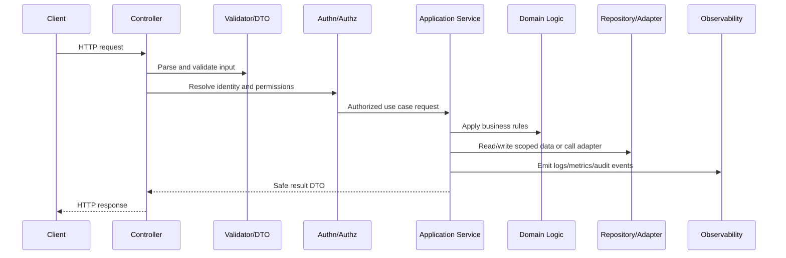

# Authentication Implementation

> *"Defines authentication implementation standards for sessions/tokens, identity resolution, credential handling, MFA readiness, login events, and secure session lifecycle."*

---

# Purpose

Defines authentication implementation standards for sessions/tokens, identity resolution, credential handling, MFA readiness, login events, and secure session lifecycle.

---

# Backend Problem

Authentication bugs can compromise every downstream authorization decision.

---

# Backend Decision

## Decision

CLARA authentication should identify users securely, protect sessions/tokens, log safe auth events, and fail closed on ambiguous identity state.

## Status

Accepted.

---

# Backend Implementation Rule

Every backend capability should be implemented as:

```text
Route/Controller -> Validation DTO -> Authentication Context -> Authorization Policy -> Application Service -> Domain Logic -> Repository/Adapter -> Observability -> Tests
```

A backend change is not production-ready if it cannot answer:

```text
what input is accepted
how input is validated
who is authenticated
what authorization is enforced
what business rule is applied
what data is accessed
how tenant/workspace scope is enforced
what error is returned
what is logged/measured
what tests prove the behavior
```

---

# Recommended Backend Flow



---

# Production-Ready Checklist

- [ ] Boundary validation exists.
- [ ] DTOs are explicit.
- [ ] Authentication context is resolved safely.
- [ ] Authorization policy is enforced.
- [ ] Business logic is testable.
- [ ] Data access is scoped.
- [ ] External calls have timeout/failure handling.
- [ ] Errors are safe and consistent.
- [ ] Logs/metrics/audit events are safe.
- [ ] Unit/integration/security tests exist.

---

# Acceptance Criteria

- [ ] Backend layer responsibility is clear.
- [ ] Security controls are explicit.
- [ ] Data boundaries are protected.
- [ ] Error and observability behavior is defined.
- [ ] Testing expectations are clear.
- [ ] AI coding assistants can apply this safely.

---

# Anti-patterns

Avoid:

- Fat controllers.
- Business logic inside database queries only.
- Repository methods that skip tenant/workspace scope.
- Authorization only in frontend.
- Returning raw database entities.
- Logging full request bodies by default.
- Throwing raw provider/database errors to clients.
- Retrying unsafe mutations.
- Tests that only cover happy paths.
- Adding endpoints without observability.

---

# Related Documents

- ../PART-01-Implementation-Foundation/README.md
- ../PART-02-Repository-and-Module-Implementation/README.md
- ../../BOOK-06-Security-Governance-and-Compliance/BOOK-06-Master-Index/README.md
- ../../BOOK-07-Operations-Observability-and-Reliability/BOOK-07-Master-Index/README.md
- ../../BOOK-04-Data-API-AI-and-Integration-Design/README.md

---

# Navigation

**Previous:** `31-Repository-and-Data-Access-Standards.md`

**Next:** `33-Authorization-Implementation.md`

---

# Authentication Responsibilities

Authentication implementation should:

```text
resolve identity
validate session/token
handle expiry/revocation
protect credential flows
emit safe auth events
attach actor context
fail closed on ambiguous identity
```

---

# Auth Context Shape

Recommended context fields:

```text
actor_id
organization_id
workspace_ids
roles
session_id
auth_method
is_service_account
request_id
```

---

# Session/Token Rules

```text
do not log raw tokens
store tokens securely
use secure cookies where applicable
enforce expiry
support revocation
protect refresh flows
separate machine/service identities
```

---

# Auth Event Examples

```text
auth.login.success
auth.login.failure
auth.session.revoked
auth.token.refresh.failed
auth.mfa.challenge.required
```
