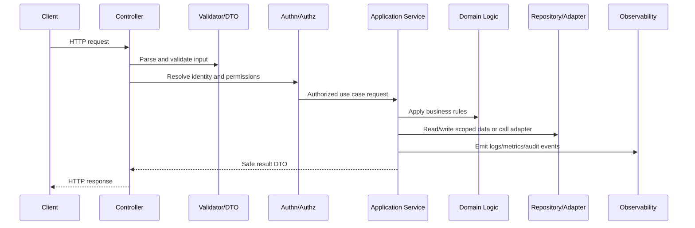

# Authorization Implementation

> *"Defines authorization implementation standards for RBAC/ABAC/policies, workspace scope, ownership checks, service-level guards, and test coverage."*

---

# Purpose

Defines authorization implementation standards for RBAC/ABAC/policies, workspace scope, ownership checks, service-level guards, and test coverage.

---

# Backend Problem

Broken access control is one of the highest-risk backend failure modes.

---

# Backend Decision

## Decision

CLARA authorization should be explicit, centralized enough to be consistent, and enforced on every sensitive operation regardless of UI behavior.

## Status

Accepted.

---

# Backend Implementation Rule

Every backend capability should be implemented as:

```text
Route/Controller -> Validation DTO -> Authentication Context -> Authorization Policy -> Application Service -> Domain Logic -> Repository/Adapter -> Observability -> Tests
```

A backend change is not production-ready if it cannot answer:

```text
what input is accepted
how input is validated
who is authenticated
what authorization is enforced
what business rule is applied
what data is accessed
how tenant/workspace scope is enforced
what error is returned
what is logged/measured
what tests prove the behavior
```

---

# Recommended Backend Flow



---

# Production-Ready Checklist

- [ ] Boundary validation exists.
- [ ] DTOs are explicit.
- [ ] Authentication context is resolved safely.
- [ ] Authorization policy is enforced.
- [ ] Business logic is testable.
- [ ] Data access is scoped.
- [ ] External calls have timeout/failure handling.
- [ ] Errors are safe and consistent.
- [ ] Logs/metrics/audit events are safe.
- [ ] Unit/integration/security tests exist.

---

# Acceptance Criteria

- [ ] Backend layer responsibility is clear.
- [ ] Security controls are explicit.
- [ ] Data boundaries are protected.
- [ ] Error and observability behavior is defined.
- [ ] Testing expectations are clear.
- [ ] AI coding assistants can apply this safely.

---

# Anti-patterns

Avoid:

- Fat controllers.
- Business logic inside database queries only.
- Repository methods that skip tenant/workspace scope.
- Authorization only in frontend.
- Returning raw database entities.
- Logging full request bodies by default.
- Throwing raw provider/database errors to clients.
- Retrying unsafe mutations.
- Tests that only cover happy paths.
- Adding endpoints without observability.

---

# Related Documents

- ../PART-01-Implementation-Foundation/README.md
- ../PART-02-Repository-and-Module-Implementation/README.md
- ../../BOOK-06-Security-Governance-and-Compliance/BOOK-06-Master-Index/README.md
- ../../BOOK-07-Operations-Observability-and-Reliability/BOOK-07-Master-Index/README.md
- ../../BOOK-04-Data-API-AI-and-Integration-Design/README.md

---

# Navigation

**Previous:** `32-Authentication-Implementation.md`

**Next:** `34-Backend-Error-Handling-and-Response-Standards.md`

---

# Authorization Responsibilities

Authorization should answer:

```text
can this actor perform this action on this resource in this workspace?
```

---

# Policy Examples

```text
canViewConversation(actor, conversation)
canSendReply(actor, conversation)
canUpdateTicket(actor, ticket)
canManageIntegration(actor, integration)
canGenerateAIReplyDraft(actor, conversation)
canExportCustomerData(actor, workspace)
```

---

# Authorization Test Matrix

Test:

```text
allowed role
forbidden role
wrong workspace
missing authentication
resource not found
suspended/disabled user
service account scope
admin/system override if applicable
```

---

# Authorization Rule

Do not hide forbidden resources by accident.

Decide deliberately whether response should be `403` or `404` based on data exposure risk.
