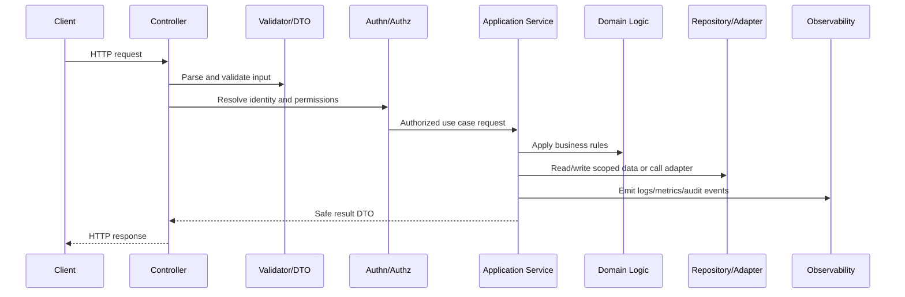

# Backend Error Handling and Response Standards

> *"Defines backend error handling standards for typed errors, safe responses, status codes, correlation IDs, retries, and operator visibility."*

---

# Purpose

Defines backend error handling standards for typed errors, safe responses, status codes, correlation IDs, retries, and operator visibility.

---

# Backend Problem

Poor error handling creates bad UX, weak observability, and sensitive information exposure.

---

# Backend Decision

## Decision

CLARA backend errors should be safe for users, useful for operators, consistent for clients, and never leak secrets or internal implementation details.

## Status

Accepted.

---

# Backend Implementation Rule

Every backend capability should be implemented as:

```text
Route/Controller -> Validation DTO -> Authentication Context -> Authorization Policy -> Application Service -> Domain Logic -> Repository/Adapter -> Observability -> Tests
```

A backend change is not production-ready if it cannot answer:

```text
what input is accepted
how input is validated
who is authenticated
what authorization is enforced
what business rule is applied
what data is accessed
how tenant/workspace scope is enforced
what error is returned
what is logged/measured
what tests prove the behavior
```

---

# Recommended Backend Flow



---

# Production-Ready Checklist

- [ ] Boundary validation exists.
- [ ] DTOs are explicit.
- [ ] Authentication context is resolved safely.
- [ ] Authorization policy is enforced.
- [ ] Business logic is testable.
- [ ] Data access is scoped.
- [ ] External calls have timeout/failure handling.
- [ ] Errors are safe and consistent.
- [ ] Logs/metrics/audit events are safe.
- [ ] Unit/integration/security tests exist.

---

# Acceptance Criteria

- [ ] Backend layer responsibility is clear.
- [ ] Security controls are explicit.
- [ ] Data boundaries are protected.
- [ ] Error and observability behavior is defined.
- [ ] Testing expectations are clear.
- [ ] AI coding assistants can apply this safely.

---

# Anti-patterns

Avoid:

- Fat controllers.
- Business logic inside database queries only.
- Repository methods that skip tenant/workspace scope.
- Authorization only in frontend.
- Returning raw database entities.
- Logging full request bodies by default.
- Throwing raw provider/database errors to clients.
- Retrying unsafe mutations.
- Tests that only cover happy paths.
- Adding endpoints without observability.

---

# Related Documents

- ../PART-01-Implementation-Foundation/README.md
- ../PART-02-Repository-and-Module-Implementation/README.md
- ../../BOOK-06-Security-Governance-and-Compliance/BOOK-06-Master-Index/README.md
- ../../BOOK-07-Operations-Observability-and-Reliability/BOOK-07-Master-Index/README.md
- ../../BOOK-04-Data-API-AI-and-Integration-Design/README.md

---

# Navigation

**Previous:** `33-Authorization-Implementation.md`

**Next:** `35-Backend-Observability-and-Audit-Events.md`

---

# Error Model

Recommended error categories:

```text
ValidationError
AuthenticationError
AuthorizationError
NotFoundError
ConflictError
RateLimitError
DependencyError
DomainRuleViolation
InternalError
```

---

# Error Response Shape

```json
{
  "error": {
    "code": "TICKET_NOT_FOUND",
    "message": "Ticket not found.",
    "request_id": "req_..."
  }
}
```

---

# Error Handling Rules

```text
client sees safe message
operators get structured logs with request_id
expected domain errors map to expected status codes
unexpected errors map to generic 500
provider/database details are not exposed to client
```

---

# Error Security Rule

Never return stack traces, SQL details, raw provider payloads, tokens, or secret values to clients.
