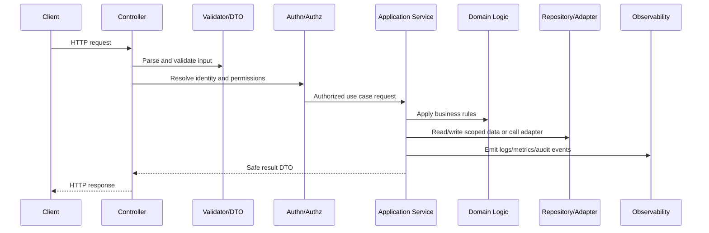

# Backend Observability and Audit Events

> *"Defines backend observability implementation for structured logs, metrics, traces, audit events, correlation IDs, and business workflow instrumentation."*

---

# Purpose

Defines backend observability implementation for structured logs, metrics, traces, audit events, correlation IDs, and business workflow instrumentation.

---

# Backend Problem

Without backend observability, production issues become guesswork.

---

# Backend Decision

## Decision

CLARA backend services should emit safe telemetry that supports debugging, incident response, SLOs, support escalation, and audit evidence.

## Status

Accepted.

---

# Backend Implementation Rule

Every backend capability should be implemented as:

```text
Route/Controller -> Validation DTO -> Authentication Context -> Authorization Policy -> Application Service -> Domain Logic -> Repository/Adapter -> Observability -> Tests
```

A backend change is not production-ready if it cannot answer:

```text
what input is accepted
how input is validated
who is authenticated
what authorization is enforced
what business rule is applied
what data is accessed
how tenant/workspace scope is enforced
what error is returned
what is logged/measured
what tests prove the behavior
```

---

# Recommended Backend Flow



---

# Production-Ready Checklist

- [ ] Boundary validation exists.
- [ ] DTOs are explicit.
- [ ] Authentication context is resolved safely.
- [ ] Authorization policy is enforced.
- [ ] Business logic is testable.
- [ ] Data access is scoped.
- [ ] External calls have timeout/failure handling.
- [ ] Errors are safe and consistent.
- [ ] Logs/metrics/audit events are safe.
- [ ] Unit/integration/security tests exist.

---

# Acceptance Criteria

- [ ] Backend layer responsibility is clear.
- [ ] Security controls are explicit.
- [ ] Data boundaries are protected.
- [ ] Error and observability behavior is defined.
- [ ] Testing expectations are clear.
- [ ] AI coding assistants can apply this safely.

---

# Anti-patterns

Avoid:

- Fat controllers.
- Business logic inside database queries only.
- Repository methods that skip tenant/workspace scope.
- Authorization only in frontend.
- Returning raw database entities.
- Logging full request bodies by default.
- Throwing raw provider/database errors to clients.
- Retrying unsafe mutations.
- Tests that only cover happy paths.
- Adding endpoints without observability.

---

# Related Documents

- ../PART-01-Implementation-Foundation/README.md
- ../PART-02-Repository-and-Module-Implementation/README.md
- ../../BOOK-06-Security-Governance-and-Compliance/BOOK-06-Master-Index/README.md
- ../../BOOK-07-Operations-Observability-and-Reliability/BOOK-07-Master-Index/README.md
- ../../BOOK-04-Data-API-AI-and-Integration-Design/README.md

---

# Navigation

**Previous:** `34-Backend-Error-Handling-and-Response-Standards.md`

**Next:** `36-Backend-Testing-and-Readiness-Checklist.md`

---

# Backend Observability Signals

Backend should emit:

```text
request_count
request_duration_ms
request_error_count
auth_success/failure events
authorization_denied events
domain workflow success/failure events
database query duration
dependency latency/errors
queue enqueue events
AI Gateway request metadata
integration processing metadata
```

---

# Required Log Fields

```text
timestamp
level
service
environment
request_id
correlation_id
actor_id where safe
workspace_id where safe
event
result
duration_ms
error_code
```

---

# Audit Event Candidates

Audit sensitive actions:

```text
role changed
integration connected/disconnected
credential reference rotated
customer data exported
ticket deleted/merged
security setting changed
admin impersonation if supported
AI tool/action executed if sensitive
```

---

# Telemetry Rule

Logs explain what happened.

Metrics show whether it is getting worse.

Audit events prove sensitive actions occurred.
