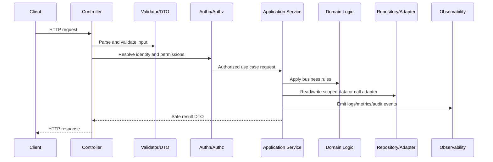

# Backend Testing and Readiness Checklist

> *"Defines backend testing standards and readiness checklist for unit, integration, contract, security, authorization, performance-sensitive, and observability tests."*

---

# Purpose

Defines backend testing standards and readiness checklist for unit, integration, contract, security, authorization, performance-sensitive, and observability tests.

---

# Backend Problem

Backend code that works locally is not automatically production-ready.

---

# Backend Decision

## Decision

CLARA backend implementation should not be considered ready until tests, security checks, observability, and operational readiness expectations are satisfied.

## Status

Accepted.

---

# Backend Implementation Rule

Every backend capability should be implemented as:

```text
Route/Controller -> Validation DTO -> Authentication Context -> Authorization Policy -> Application Service -> Domain Logic -> Repository/Adapter -> Observability -> Tests
```

A backend change is not production-ready if it cannot answer:

```text
what input is accepted
how input is validated
who is authenticated
what authorization is enforced
what business rule is applied
what data is accessed
how tenant/workspace scope is enforced
what error is returned
what is logged/measured
what tests prove the behavior
```

---

# Recommended Backend Flow



---

# Production-Ready Checklist

- [ ] Boundary validation exists.
- [ ] DTOs are explicit.
- [ ] Authentication context is resolved safely.
- [ ] Authorization policy is enforced.
- [ ] Business logic is testable.
- [ ] Data access is scoped.
- [ ] External calls have timeout/failure handling.
- [ ] Errors are safe and consistent.
- [ ] Logs/metrics/audit events are safe.
- [ ] Unit/integration/security tests exist.

---

# Acceptance Criteria

- [ ] Backend layer responsibility is clear.
- [ ] Security controls are explicit.
- [ ] Data boundaries are protected.
- [ ] Error and observability behavior is defined.
- [ ] Testing expectations are clear.
- [ ] AI coding assistants can apply this safely.

---

# Anti-patterns

Avoid:

- Fat controllers.
- Business logic inside database queries only.
- Repository methods that skip tenant/workspace scope.
- Authorization only in frontend.
- Returning raw database entities.
- Logging full request bodies by default.
- Throwing raw provider/database errors to clients.
- Retrying unsafe mutations.
- Tests that only cover happy paths.
- Adding endpoints without observability.

---

# Related Documents

- ../PART-01-Implementation-Foundation/README.md
- ../PART-02-Repository-and-Module-Implementation/README.md
- ../../BOOK-06-Security-Governance-and-Compliance/BOOK-06-Master-Index/README.md
- ../../BOOK-07-Operations-Observability-and-Reliability/BOOK-07-Master-Index/README.md
- ../../BOOK-04-Data-API-AI-and-Integration-Design/README.md

---

# Navigation

**Previous:** `35-Backend-Observability-and-Audit-Events.md`

**Next:** `../PART-04-Frontend-and-Client-Implementation/README.md`

---

# Backend Test Types

Backend implementation should include:

```text
unit tests for domain logic
unit tests for application services
integration tests for repositories
API tests for routes/controllers
contract tests for DTOs/events
authorization tests for policies
security tests for validation/injection/IDOR
observability tests where practical
```

---

# Backend Readiness Checklist

- [ ] API boots with validated config.
- [ ] Health/readiness endpoints exist.
- [ ] Controllers are thin.
- [ ] Input validation exists.
- [ ] DTOs are explicit.
- [ ] Application services own orchestration.
- [ ] Domain logic is tested.
- [ ] Repositories enforce scope.
- [ ] Authn/authz are tested.
- [ ] Errors are safe.
- [ ] Logs/metrics/audit events are implemented.
- [ ] CI commands are documented.

---

# Part 03 Completion

Part 03 establishes:

- Backend implementation overview.
- API service bootstrap.
- Routing and controller standards.
- Validation and DTO standards.
- Application service standards.
- Domain logic standards.
- Repository and data access standards.
- Authentication implementation.
- Authorization implementation.
- Error handling and response standards.
- Backend observability and audit events.
- Backend testing and readiness checklist.

---

# Ready for Part 04

The next part should be:

```text
BOOK VIII — PART 04: Frontend and Client Implementation
```

It should define:

- Frontend implementation overview.
- App bootstrap.
- Routing and layout.
- Component standards.
- State management.
- API client implementation.
- Form validation.
- Auth and permission UI.
- Error/loading/empty states.
- Frontend security.
- Frontend testing and readiness.
