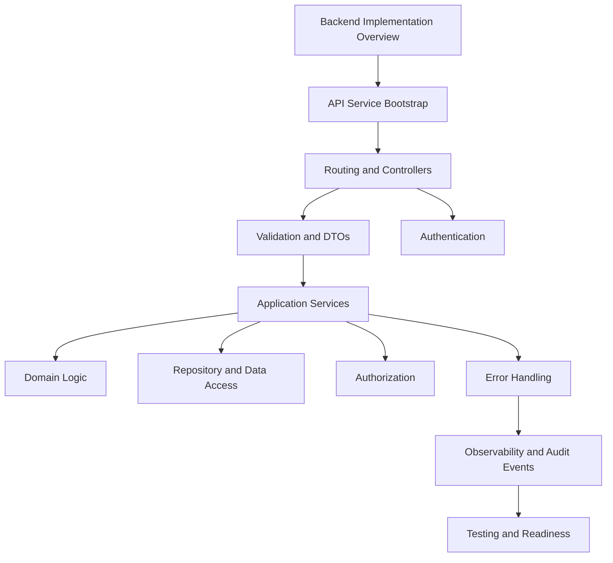

# PART-03 — Backend Implementation

> *"A production backend is not just endpoints. It is validation, authorization, business logic, data safety, observability, and recovery behavior working together."*

---

# Purpose

Part 03 defines CLARA's backend implementation standards.

It covers:

- Backend Implementation overview.
- API Service Bootstrap.
- Routing and Controller Standards.
- Validation and DTO Standards.
- Application Service Standards.
- Domain Logic Standards.
- Repository and Data Access Standards.
- Authentication Implementation.
- Authorization Implementation.
- Backend Error Handling and Response Standards.
- Backend Observability and Audit Events.
- Backend Testing and Readiness Checklist.

---

# Chapter Map

| Chapter | Title |
|---:|---|
| 25 | Backend Implementation Overview |
| 26 | API Service Bootstrap |
| 27 | Routing and Controller Standards |
| 28 | Validation and DTO Standards |
| 29 | Application Service Standards |
| 30 | Domain Logic Standards |
| 31 | Repository and Data Access Standards |
| 32 | Authentication Implementation |
| 33 | Authorization Implementation |
| 34 | Backend Error Handling and Response Standards |
| 35 | Backend Observability and Audit Events |
| 36 | Backend Testing and Readiness Checklist |

---

# Backend Implementation Map



---

# Backend Non-Negotiables

CLARA backend implementation must enforce:

```text
validated configuration
thin controllers
input validation at boundaries
explicit DTOs
application services for use cases
domain logic outside HTTP/database layers
parameterized data access
tenant/workspace scoping
authentication before identity-sensitive actions
authorization before sensitive actions
safe error responses
structured logs with correlation IDs
metrics for critical workflows
audit events for sensitive actions
security and authorization tests
```

---

# Relationship to Previous Parts

Part 01 defines implementation foundation.

Part 02 defines repository and module structure.

Part 03 defines how backend modules should be implemented inside that structure.

---

# Navigation

**Previous:** `../PART-02-Repository-and-Module-Implementation/24-Part-02-Summary.md`

**Next:** `25-Backend-Implementation-Overview.md`
