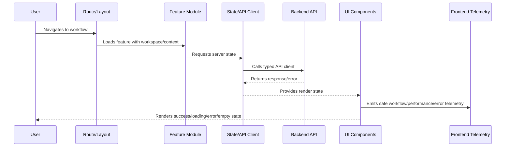

# Frontend and Client Implementation Overview

> *"Introduces CLARA's frontend and client implementation model for building secure, maintainable, accessible, observable, and production-ready user interfaces."*

---

# Purpose

Introduces CLARA's frontend and client implementation model for building secure, maintainable, accessible, observable, and production-ready user interfaces.

---

# Frontend Problem

Frontend code becomes fragile when rendering, business rules, API calls, permissions, and error handling are mixed without clear ownership.

---

# Frontend Decision

## Decision

CLARA frontend implementation should separate UI, state, API access, validation, permissions, and feature logic while preserving user experience and security boundaries.

## Status

Accepted.

---

# Frontend Implementation Rule

Every CLARA frontend feature should be implemented as:

```text
Route/Layout -> Permission Context -> Feature Module -> UI Components -> State/API Client -> Validation -> Error/Loading/Empty States -> Telemetry -> Tests
```

A frontend change is not production-ready if it cannot answer:

```text
what user workflow it supports
what API contract it consumes
what permission state it handles
what loading/error/empty states exist
what sensitive data it displays
how XSS/data exposure is prevented
what telemetry helps support/debugging
what tests cover the behavior
```

---

# Recommended Frontend Flow



---

# Production-Ready Checklist

- [ ] Route and layout are defined.
- [ ] Workspace/tenant context is handled.
- [ ] Permission UI is implemented.
- [ ] Backend authorization is not replaced by UI hiding.
- [ ] API client uses typed/validated contracts where practical.
- [ ] Loading/error/empty/degraded states exist.
- [ ] Sensitive data rendering is reviewed.
- [ ] XSS and token handling risks are addressed.
- [ ] Telemetry is privacy-safe.
- [ ] Tests cover critical paths and failure states.

---

# Acceptance Criteria

- [ ] UI structure is maintainable.
- [ ] Permission and data boundaries are respected.
- [ ] Frontend security baseline is preserved.
- [ ] User failure states are intentional.
- [ ] Observability supports support/debugging.
- [ ] AI coding assistants can apply this safely.

---

# Anti-patterns

Avoid:

- Business rules hidden only in UI.
- Authorization enforced only by hiding buttons.
- Raw `fetch` scattered across components.
- Storing secrets in frontend config.
- Rendering untrusted HTML without sanitization.
- One giant component owning everything.
- No loading/error/empty states.
- Cross-workspace data cached without scope.
- Logging sensitive data to console/analytics.
- Tests that only verify snapshots without behavior.

---

# Related Documents

- ../PART-01-Implementation-Foundation/README.md
- ../PART-02-Repository-and-Module-Implementation/README.md
- ../PART-03-Backend-Implementation/README.md
- ../../BOOK-06-Security-Governance-and-Compliance/BOOK-06-Master-Index/README.md
- ../../BOOK-07-Operations-Observability-and-Reliability/BOOK-07-Master-Index/README.md

---

# Navigation

**Previous:** `../PART-03-Backend-Implementation/36-Backend-Testing-and-Readiness-Checklist.md`

**Next:** `38-App-Bootstrap-and-Runtime-Initialization.md`

---

# Frontend Scope

CLARA frontend/client implementation covers:

```text
app bootstrap
runtime config
routing/layouts
feature modules
components
state management
API clients
forms and validation
auth and permission UI
loading/error/empty/degraded states
frontend security
frontend observability
tests and readiness
```

---

# Frontend Layering Baseline

```text
Route/Layout
  -> Feature Module
  -> Components
  -> Hooks/State
  -> API Client
  -> Backend Contract
```

---

# Guiding Question

```text
Can users complete critical workflows clearly, safely, and reliably under real production conditions?
```
