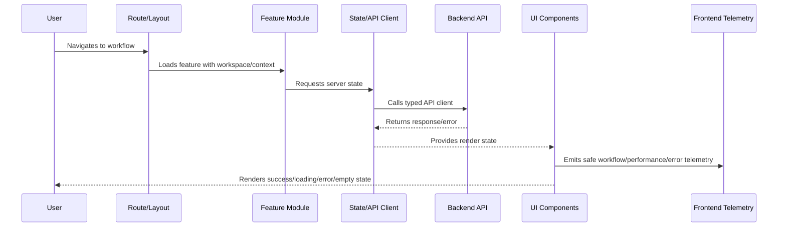

# App Bootstrap and Runtime Initialization

> *"Defines frontend app bootstrap standards including runtime configuration, provider setup, routing initialization, auth context, error boundaries, telemetry, and safe startup behavior."*

---

# Purpose

Defines frontend app bootstrap standards including runtime configuration, provider setup, routing initialization, auth context, error boundaries, telemetry, and safe startup behavior.

---

# Frontend Problem

A frontend that starts with invalid config, missing providers, or unsafe defaults creates confusing failures and security risk.

---

# Frontend Decision

## Decision

CLARA frontend apps should bootstrap predictably with validated public configuration, safe defaults, initialized clients, error boundaries, and observability.

## Status

Accepted.

---

# Frontend Implementation Rule

Every CLARA frontend feature should be implemented as:

```text
Route/Layout -> Permission Context -> Feature Module -> UI Components -> State/API Client -> Validation -> Error/Loading/Empty States -> Telemetry -> Tests
```

A frontend change is not production-ready if it cannot answer:

```text
what user workflow it supports
what API contract it consumes
what permission state it handles
what loading/error/empty states exist
what sensitive data it displays
how XSS/data exposure is prevented
what telemetry helps support/debugging
what tests cover the behavior
```

---

# Recommended Frontend Flow



---

# Production-Ready Checklist

- [ ] Route and layout are defined.
- [ ] Workspace/tenant context is handled.
- [ ] Permission UI is implemented.
- [ ] Backend authorization is not replaced by UI hiding.
- [ ] API client uses typed/validated contracts where practical.
- [ ] Loading/error/empty/degraded states exist.
- [ ] Sensitive data rendering is reviewed.
- [ ] XSS and token handling risks are addressed.
- [ ] Telemetry is privacy-safe.
- [ ] Tests cover critical paths and failure states.

---

# Acceptance Criteria

- [ ] UI structure is maintainable.
- [ ] Permission and data boundaries are respected.
- [ ] Frontend security baseline is preserved.
- [ ] User failure states are intentional.
- [ ] Observability supports support/debugging.
- [ ] AI coding assistants can apply this safely.

---

# Anti-patterns

Avoid:

- Business rules hidden only in UI.
- Authorization enforced only by hiding buttons.
- Raw `fetch` scattered across components.
- Storing secrets in frontend config.
- Rendering untrusted HTML without sanitization.
- One giant component owning everything.
- No loading/error/empty states.
- Cross-workspace data cached without scope.
- Logging sensitive data to console/analytics.
- Tests that only verify snapshots without behavior.

---

# Related Documents

- ../PART-01-Implementation-Foundation/README.md
- ../PART-02-Repository-and-Module-Implementation/README.md
- ../PART-03-Backend-Implementation/README.md
- ../../BOOK-06-Security-Governance-and-Compliance/BOOK-06-Master-Index/README.md
- ../../BOOK-07-Operations-Observability-and-Reliability/BOOK-07-Master-Index/README.md

---

# Navigation

**Previous:** `37-Frontend-and-Client-Implementation-Overview.md`

**Next:** `39-Routing-Layout-and-Navigation-Standards.md`

---

# Bootstrap Responsibilities

Frontend bootstrap should initialize:

```text
runtime public config
API client base URL
auth/session provider
workspace/context provider
routing
error boundaries
query/cache client
telemetry/analytics client
feature flag client where applicable
theme/design system
```

---

# Public Config Rules

Public config may include:

```text
public API base URL
environment name
public feature flags
telemetry public key where safe
app version/build SHA
```

Public config must not include:

```text
API secrets
private keys
provider secrets
database URLs
internal admin tokens
production credentials
```

---

# Startup Failure Rule

If required public config is missing, fail clearly with a safe error message and telemetry.
