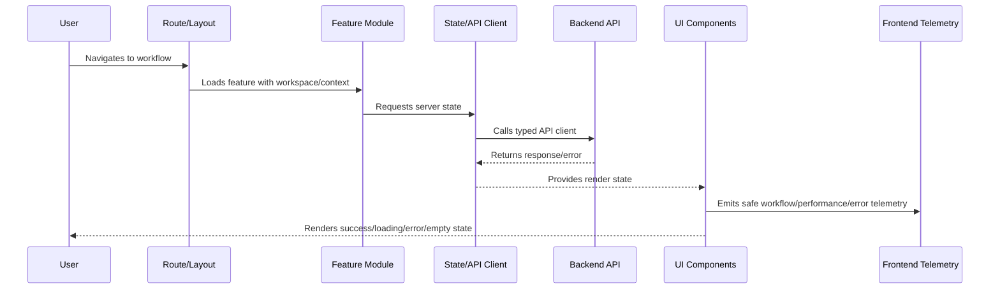

# Component Implementation Standards

> *"Defines component standards for composition, props, accessibility, design consistency, reusability, loading states, error states, and testability."*

---

# Purpose

Defines component standards for composition, props, accessibility, design consistency, reusability, loading states, error states, and testability.

---

# Frontend Problem

Large stateful components become hard to review, test, secure, and reuse.

---

# Frontend Decision

## Decision

CLARA components should be small, composable, accessible, typed where applicable, and separated between shared UI and feature-specific UI.

## Status

Accepted.

---

# Frontend Implementation Rule

Every CLARA frontend feature should be implemented as:

```text
Route/Layout -> Permission Context -> Feature Module -> UI Components -> State/API Client -> Validation -> Error/Loading/Empty States -> Telemetry -> Tests
```

A frontend change is not production-ready if it cannot answer:

```text
what user workflow it supports
what API contract it consumes
what permission state it handles
what loading/error/empty states exist
what sensitive data it displays
how XSS/data exposure is prevented
what telemetry helps support/debugging
what tests cover the behavior
```

---

# Recommended Frontend Flow



---

# Production-Ready Checklist

- [ ] Route and layout are defined.
- [ ] Workspace/tenant context is handled.
- [ ] Permission UI is implemented.
- [ ] Backend authorization is not replaced by UI hiding.
- [ ] API client uses typed/validated contracts where practical.
- [ ] Loading/error/empty/degraded states exist.
- [ ] Sensitive data rendering is reviewed.
- [ ] XSS and token handling risks are addressed.
- [ ] Telemetry is privacy-safe.
- [ ] Tests cover critical paths and failure states.

---

# Acceptance Criteria

- [ ] UI structure is maintainable.
- [ ] Permission and data boundaries are respected.
- [ ] Frontend security baseline is preserved.
- [ ] User failure states are intentional.
- [ ] Observability supports support/debugging.
- [ ] AI coding assistants can apply this safely.

---

# Anti-patterns

Avoid:

- Business rules hidden only in UI.
- Authorization enforced only by hiding buttons.
- Raw `fetch` scattered across components.
- Storing secrets in frontend config.
- Rendering untrusted HTML without sanitization.
- One giant component owning everything.
- No loading/error/empty states.
- Cross-workspace data cached without scope.
- Logging sensitive data to console/analytics.
- Tests that only verify snapshots without behavior.

---

# Related Documents

- ../PART-01-Implementation-Foundation/README.md
- ../PART-02-Repository-and-Module-Implementation/README.md
- ../PART-03-Backend-Implementation/README.md
- ../../BOOK-06-Security-Governance-and-Compliance/BOOK-06-Master-Index/README.md
- ../../BOOK-07-Operations-Observability-and-Reliability/BOOK-07-Master-Index/README.md

---

# Navigation

**Previous:** `39-Routing-Layout-and-Navigation-Standards.md`

**Next:** `41-State-Management-Standards.md`

---

# Component Categories

Use clear categories:

```text
shared UI components
layout components
feature components
page components
form components
data display components
feedback components
```

---

# Component Checklist

- [ ] Purpose is clear.
- [ ] Props are explicit.
- [ ] Accessible labels/roles exist where needed.
- [ ] Loading state is handled where needed.
- [ ] Error state is handled where needed.
- [ ] No secret/sensitive data in logs.
- [ ] Business rules are not hidden deep in rendering.
- [ ] Component is testable.

---

# Accessibility Baseline

Implement:

```text
keyboard navigation
semantic HTML
labels for inputs
focus management for modals/dialogs
color contrast awareness
screen-reader-friendly status messages
```

---

# Component Rule

Shared UI components should be generic.

Feature-specific rules should live in feature modules.
