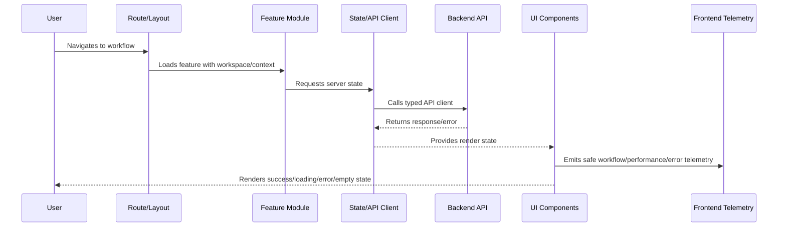

# Frontend Observability and Analytics

> *"Defines frontend telemetry for errors, performance, user-impact events, workflow metrics, correlation IDs, privacy-safe analytics, and support evidence."*

---

# Purpose

Defines frontend telemetry for errors, performance, user-impact events, workflow metrics, correlation IDs, privacy-safe analytics, and support evidence.

---

# Frontend Problem

Backend metrics can look healthy while the frontend experience is slow, broken, or confusing.

---

# Frontend Decision

## Decision

CLARA frontend should emit privacy-safe telemetry that helps engineering and support understand real user impact.

## Status

Accepted.

---

# Frontend Implementation Rule

Every CLARA frontend feature should be implemented as:

```text
Route/Layout -> Permission Context -> Feature Module -> UI Components -> State/API Client -> Validation -> Error/Loading/Empty States -> Telemetry -> Tests
```

A frontend change is not production-ready if it cannot answer:

```text
what user workflow it supports
what API contract it consumes
what permission state it handles
what loading/error/empty states exist
what sensitive data it displays
how XSS/data exposure is prevented
what telemetry helps support/debugging
what tests cover the behavior
```

---

# Recommended Frontend Flow



---

# Production-Ready Checklist

- [ ] Route and layout are defined.
- [ ] Workspace/tenant context is handled.
- [ ] Permission UI is implemented.
- [ ] Backend authorization is not replaced by UI hiding.
- [ ] API client uses typed/validated contracts where practical.
- [ ] Loading/error/empty/degraded states exist.
- [ ] Sensitive data rendering is reviewed.
- [ ] XSS and token handling risks are addressed.
- [ ] Telemetry is privacy-safe.
- [ ] Tests cover critical paths and failure states.

---

# Acceptance Criteria

- [ ] UI structure is maintainable.
- [ ] Permission and data boundaries are respected.
- [ ] Frontend security baseline is preserved.
- [ ] User failure states are intentional.
- [ ] Observability supports support/debugging.
- [ ] AI coding assistants can apply this safely.

---

# Anti-patterns

Avoid:

- Business rules hidden only in UI.
- Authorization enforced only by hiding buttons.
- Raw `fetch` scattered across components.
- Storing secrets in frontend config.
- Rendering untrusted HTML without sanitization.
- One giant component owning everything.
- No loading/error/empty states.
- Cross-workspace data cached without scope.
- Logging sensitive data to console/analytics.
- Tests that only verify snapshots without behavior.

---

# Related Documents

- ../PART-01-Implementation-Foundation/README.md
- ../PART-02-Repository-and-Module-Implementation/README.md
- ../PART-03-Backend-Implementation/README.md
- ../../BOOK-06-Security-Governance-and-Compliance/BOOK-06-Master-Index/README.md
- ../../BOOK-07-Operations-Observability-and-Reliability/BOOK-07-Master-Index/README.md

---

# Navigation

**Previous:** `46-Frontend-Security-and-Privacy-Baseline.md`

**Next:** `48-Frontend-Testing-and-Readiness-Checklist.md`

---

# Frontend Telemetry Signals

Track:

```text
route load duration
critical workflow success/failure
client-side errors
API error categories
permission denied events
form validation error trends
AI draft UI latency
integration status UI events
degraded mode usage
frontend performance metrics
```

---

# Privacy-Safe Analytics

Telemetry should avoid:

```text
raw message content
customer private data
tokens
emails unless explicitly approved/hash-safe
full URLs with sensitive query params
file names if sensitive
raw AI prompts/outputs
```

---

# Support Evidence

Frontend can help support with:

```text
request_id
correlation_id
app version
route/template
workspace context reference
safe error code
timestamp
browser/device metadata where appropriate
```

---

# Observability Rule

Frontend telemetry should explain user impact, not spy on users.
