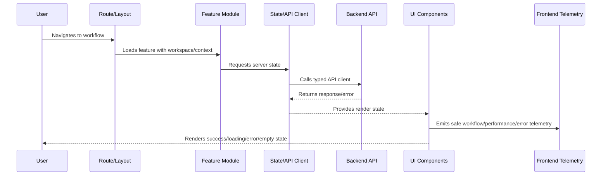

# Frontend Testing and Readiness Checklist

> *"Defines frontend testing and readiness standards for unit, component, integration, accessibility, security, visual regression, e2e, and production readiness checks."*

---

# Purpose

Defines frontend testing and readiness standards for unit, component, integration, accessibility, security, visual regression, e2e, and production readiness checks.

---

# Frontend Problem

A UI that looks correct in one manual path may still fail in production edge cases.

---

# Frontend Decision

## Decision

CLARA frontend implementation should not be considered ready until critical workflows, permissions, states, accessibility, security, and observability are tested.

## Status

Accepted.

---

# Frontend Implementation Rule

Every CLARA frontend feature should be implemented as:

```text
Route/Layout -> Permission Context -> Feature Module -> UI Components -> State/API Client -> Validation -> Error/Loading/Empty States -> Telemetry -> Tests
```

A frontend change is not production-ready if it cannot answer:

```text
what user workflow it supports
what API contract it consumes
what permission state it handles
what loading/error/empty states exist
what sensitive data it displays
how XSS/data exposure is prevented
what telemetry helps support/debugging
what tests cover the behavior
```

---

# Recommended Frontend Flow



---

# Production-Ready Checklist

- [ ] Route and layout are defined.
- [ ] Workspace/tenant context is handled.
- [ ] Permission UI is implemented.
- [ ] Backend authorization is not replaced by UI hiding.
- [ ] API client uses typed/validated contracts where practical.
- [ ] Loading/error/empty/degraded states exist.
- [ ] Sensitive data rendering is reviewed.
- [ ] XSS and token handling risks are addressed.
- [ ] Telemetry is privacy-safe.
- [ ] Tests cover critical paths and failure states.

---

# Acceptance Criteria

- [ ] UI structure is maintainable.
- [ ] Permission and data boundaries are respected.
- [ ] Frontend security baseline is preserved.
- [ ] User failure states are intentional.
- [ ] Observability supports support/debugging.
- [ ] AI coding assistants can apply this safely.

---

# Anti-patterns

Avoid:

- Business rules hidden only in UI.
- Authorization enforced only by hiding buttons.
- Raw `fetch` scattered across components.
- Storing secrets in frontend config.
- Rendering untrusted HTML without sanitization.
- One giant component owning everything.
- No loading/error/empty states.
- Cross-workspace data cached without scope.
- Logging sensitive data to console/analytics.
- Tests that only verify snapshots without behavior.

---

# Related Documents

- ../PART-01-Implementation-Foundation/README.md
- ../PART-02-Repository-and-Module-Implementation/README.md
- ../PART-03-Backend-Implementation/README.md
- ../../BOOK-06-Security-Governance-and-Compliance/BOOK-06-Master-Index/README.md
- ../../BOOK-07-Operations-Observability-and-Reliability/BOOK-07-Master-Index/README.md

---

# Navigation

**Previous:** `47-Frontend-Observability-and-Analytics.md`

**Next:** `../PART-05-Database-and-Migration-Implementation/README.md`

---

# Frontend Test Types

Use:

```text
unit tests for pure utilities
component tests for rendering and interaction
hook/state tests
API client tests with mocks
integration tests for feature flows
e2e tests for critical user journeys
accessibility tests
security-focused tests for unsafe rendering/permission states
visual regression where useful
```

---

# Critical Workflow Test Candidates

```text
login/session refresh
workspace switch
inbox load
conversation open
send reply
ticket update
AI draft generation UI
integration settings
attachment upload/download
export request
permission denied state
```

---

# Frontend Readiness Checklist

- [ ] App boots with validated config.
- [ ] Routes are workspace/permission-aware.
- [ ] Critical components are accessible.
- [ ] Server state and UI state are separated.
- [ ] API client handles known errors consistently.
- [ ] Forms validate and map backend errors.
- [ ] Loading/error/empty/degraded states exist.
- [ ] XSS/token/data exposure risks reviewed.
- [ ] Frontend telemetry is privacy-safe.
- [ ] Critical workflow tests exist.

---

# Part 04 Completion

Part 04 establishes:

- Frontend and client implementation overview.
- App bootstrap and runtime initialization.
- Routing, layout, and navigation standards.
- Component implementation standards.
- State management standards.
- API client implementation.
- Form and input validation implementation.
- Auth and permission UI implementation.
- Error, loading, empty, and degraded states.
- Frontend security and privacy baseline.
- Frontend observability and analytics.
- Frontend testing and readiness checklist.

---

# Ready for Part 05

The next part should be:

```text
BOOK VIII — PART 05: Database and Migration Implementation
```

It should define:

- Database implementation overview.
- Schema implementation standards.
- Migration workflow.
- Seeding strategy.
- Repository integration.
- Tenant/workspace scoping.
- Indexing and query performance.
- Transaction patterns.
- Audit/data retention implementation.
- Backup/restore compatibility.
- Database testing and readiness.
