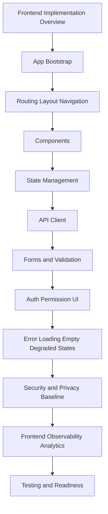

# PART-04 — Frontend and Client Implementation

> *"A production frontend is not only what users see. It is how safely and clearly users interact with production state."*

---

# Purpose

Part 04 defines CLARA's frontend and client implementation standards.

It covers:

- Frontend and Client Implementation overview.
- App Bootstrap and Runtime Initialization.
- Routing Layout and Navigation Standards.
- Component Implementation Standards.
- State Management Standards.
- API Client Implementation.
- Form and Input Validation Implementation.
- Auth and Permission UI Implementation.
- Error Loading Empty and Degraded States.
- Frontend Security and Privacy Baseline.
- Frontend Observability and Analytics.
- Frontend Testing and Readiness Checklist.

---

# Chapter Map

| Chapter | Title |
|---:|---|
| 37 | Frontend and Client Implementation Overview |
| 38 | App Bootstrap and Runtime Initialization |
| 39 | Routing Layout and Navigation Standards |
| 40 | Component Implementation Standards |
| 41 | State Management Standards |
| 42 | API Client Implementation |
| 43 | Form and Input Validation Implementation |
| 44 | Auth and Permission UI Implementation |
| 45 | Error Loading Empty and Degraded States |
| 46 | Frontend Security and Privacy Baseline |
| 47 | Frontend Observability and Analytics |
| 48 | Frontend Testing and Readiness Checklist |

---

# Frontend Implementation Map



---

# Frontend Non-Negotiables

CLARA frontend implementation must enforce:

```text
safe app bootstrap
public config validation
workspace-aware routing
permission-aware UI
backend-enforced authorization
small accessible components
separation of server state and UI state
central API client
safe form validation
intentional loading/error/empty states
XSS-safe rendering
no client-side secrets
privacy-safe telemetry
critical workflow tests
accessibility checks
```

---

# Relationship to Previous Parts

Part 02 defines repository and module structure.

Part 03 defines backend implementation.

Part 04 defines frontend/client implementation that safely consumes backend contracts and presents CLARA workflows to users.

---

# Navigation

**Previous:** `../PART-03-Backend-Implementation/36-Backend-Testing-and-Readiness-Checklist.md`

**Next:** `37-Frontend-and-Client-Implementation-Overview.md`
