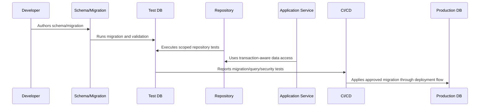

# Database and Migration Implementation Overview

> *"Introduces CLARA's database and migration implementation model for building safe, scalable, tenant-aware, auditable, and recoverable production data systems."*

---

# Purpose

Introduces CLARA's database and migration implementation model for building safe, scalable, tenant-aware, auditable, and recoverable production data systems.

---

# Database Problem

Database implementation mistakes are expensive because they can cause data corruption, data exposure, downtime, and difficult recovery.

---

# Database Decision

## Decision

CLARA database implementation should prioritize data correctness, tenant/workspace isolation, migration safety, query performance, auditability, retention, and restore compatibility.

## Status

Accepted.

---

# Database Implementation Rule

Every CLARA database-backed capability should be implemented as:

```text
Schema -> Constraints -> Migration -> Repository -> Scoped Query -> Transaction/Consistency Rule -> Observability -> Tests -> Restore Compatibility
```

A database change is not production-ready if it cannot answer:

```text
what data it owns
what constraints protect correctness
how tenant/workspace scope is enforced
how migration runs safely
how rollback/forward-fix works
how queries perform at expected scale
how sensitive data is protected
how data is retained/deleted
how restore validation works
what tests prove the behavior
```

---

# Recommended Database Flow



---

# Production-Ready Checklist

- [ ] Schema naming is clear.
- [ ] Constraints protect critical invariants.
- [ ] Migration is reviewed.
- [ ] Migration is tested.
- [ ] Queries are tenant/workspace scoped.
- [ ] Data access is parameterized.
- [ ] Transactions are explicit where needed.
- [ ] Indexes support critical queries.
- [ ] Sensitive data is protected.
- [ ] Restore compatibility is considered.

---

# Acceptance Criteria

- [ ] Data model is understandable.
- [ ] Migration is safe enough for production.
- [ ] Scoping prevents cross-tenant access.
- [ ] Query performance is considered.
- [ ] Data lifecycle rules are clear.
- [ ] Database security expectations are clear.
- [ ] AI coding assistants can follow this safely.

---

# Anti-patterns

Avoid:

- Migrations that run only on empty databases.
- Unbounded list queries.
- Missing organization/workspace scope.
- Storing secrets in plain database columns without protection strategy.
- Business-critical invariants only in comments.
- Large table rewrites during peak traffic.
- Using production data as local seed data.
- Deleting data with no audit trail when audit is required.
- Repository methods returning data across tenants.
- Tests that do not include wrong-workspace cases.

---

# Related Documents

- ../PART-03-Backend-Implementation/README.md
- ../PART-02-Repository-and-Module-Implementation/README.md
- ../../BOOK-06-Security-Governance-and-Compliance/BOOK-06-Master-Index/README.md
- ../../BOOK-07-Operations-Observability-and-Reliability/PART-07-Backup-Restore-and-Disaster-Recovery/README.md
- ../../BOOK-07-Operations-Observability-and-Reliability/PART-06-Performance-and-Capacity/README.md

---

# Navigation

**Previous:** `../PART-04-Frontend-and-Client-Implementation/48-Frontend-Testing-and-Readiness-Checklist.md`

**Next:** `50-Schema-Implementation-Standards.md`

---

# Database Scope

CLARA database implementation covers:

```text
organizations
workspaces
users and memberships
roles and permissions
customers/contacts
conversations/messages
tickets
knowledge base records
AI metadata and review state
integration state
webhook processing state
attachments metadata
audit logs
exports
operational evidence references
```

---

# Data Safety Questions

```text
Who owns this data?
Which workspace can access it?
What constraints prevent invalid state?
What is sensitive?
What must be audited?
What must be retained/deleted?
How is it restored?
How does it perform at scale?
```

---

# Database Principle

If a data rule matters for production correctness, encode it in schema, domain logic, or tests — preferably more than one layer for critical rules.
