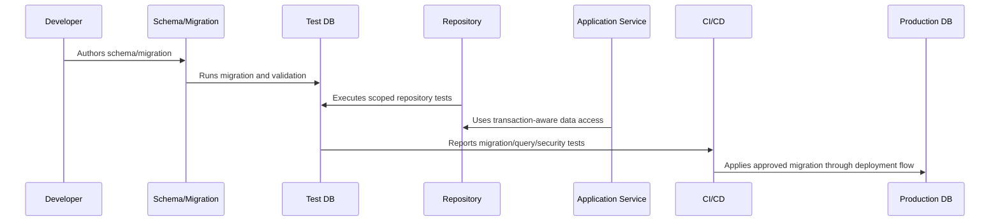

# Migration Workflow and Safety

> *"Defines migration authoring, review, execution, rollback/forward-fix, locking, deployment order, and safety checks."*

---

# Purpose

Defines migration authoring, review, execution, rollback/forward-fix, locking, deployment order, and safety checks.

---

# Database Problem

Unsafe migrations can lock tables, corrupt data, or break production during deployment.

---

# Database Decision

## Decision

CLARA migrations should be reviewed, reversible or forward-fixable, tested on realistic data, and safe for production deployment.

## Status

Accepted.

---

# Database Implementation Rule

Every CLARA database-backed capability should be implemented as:

```text
Schema -> Constraints -> Migration -> Repository -> Scoped Query -> Transaction/Consistency Rule -> Observability -> Tests -> Restore Compatibility
```

A database change is not production-ready if it cannot answer:

```text
what data it owns
what constraints protect correctness
how tenant/workspace scope is enforced
how migration runs safely
how rollback/forward-fix works
how queries perform at expected scale
how sensitive data is protected
how data is retained/deleted
how restore validation works
what tests prove the behavior
```

---

# Recommended Database Flow



---

# Production-Ready Checklist

- [ ] Schema naming is clear.
- [ ] Constraints protect critical invariants.
- [ ] Migration is reviewed.
- [ ] Migration is tested.
- [ ] Queries are tenant/workspace scoped.
- [ ] Data access is parameterized.
- [ ] Transactions are explicit where needed.
- [ ] Indexes support critical queries.
- [ ] Sensitive data is protected.
- [ ] Restore compatibility is considered.

---

# Acceptance Criteria

- [ ] Data model is understandable.
- [ ] Migration is safe enough for production.
- [ ] Scoping prevents cross-tenant access.
- [ ] Query performance is considered.
- [ ] Data lifecycle rules are clear.
- [ ] Database security expectations are clear.
- [ ] AI coding assistants can follow this safely.

---

# Anti-patterns

Avoid:

- Migrations that run only on empty databases.
- Unbounded list queries.
- Missing organization/workspace scope.
- Storing secrets in plain database columns without protection strategy.
- Business-critical invariants only in comments.
- Large table rewrites during peak traffic.
- Using production data as local seed data.
- Deleting data with no audit trail when audit is required.
- Repository methods returning data across tenants.
- Tests that do not include wrong-workspace cases.

---

# Related Documents

- ../PART-03-Backend-Implementation/README.md
- ../PART-02-Repository-and-Module-Implementation/README.md
- ../../BOOK-06-Security-Governance-and-Compliance/BOOK-06-Master-Index/README.md
- ../../BOOK-07-Operations-Observability-and-Reliability/PART-07-Backup-Restore-and-Disaster-Recovery/README.md
- ../../BOOK-07-Operations-Observability-and-Reliability/PART-06-Performance-and-Capacity/README.md

---

# Navigation

**Previous:** `50-Schema-Implementation-Standards.md`

**Next:** `52-Seed-Data-and-Fixture-Strategy.md`

---

# Migration Safety Checklist

- [ ] Migration has clear name.
- [ ] Migration was tested on realistic data volume.
- [ ] Migration avoids long locks where possible.
- [ ] Backfill strategy is defined if needed.
- [ ] Rollback or forward-fix strategy exists.
- [ ] Deployment ordering is clear.
- [ ] App compatibility during rollout is considered.
- [ ] Migration output/evidence is captured.

---

# Safer Migration Pattern

Prefer phased migration:

```text
1 add nullable column/table
2 deploy app that writes both if needed
3 backfill safely
4 validate
5 enforce constraint/not-null
6 remove old field after compatibility window
```

---

# Dangerous Migration Examples

```text
dropping columns immediately
renaming columns without compatibility plan
adding not-null column with no default/backfill
large table rewrite during peak traffic
unbounded data backfill in one transaction
```

---

# Migration Rule

For production data, prefer forward-safe migrations over fragile rollback assumptions.
