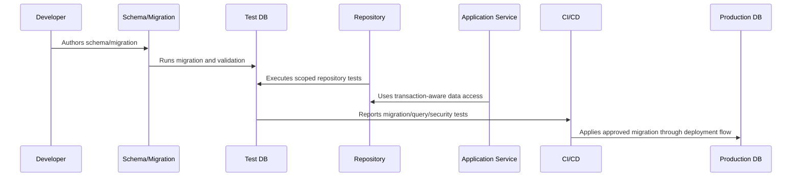

# Seed Data and Fixture Strategy

> *"Defines safe seed data, local development fixtures, test fixtures, demo data, anonymized data, and production data boundaries."*

---

# Purpose

Defines safe seed data, local development fixtures, test fixtures, demo data, anonymized data, and production data boundaries.

---

# Database Problem

Using production data casually in local or test environments creates privacy and compliance risk.

---

# Database Decision

## Decision

CLARA seed and fixture data should support development and tests without using real customer data or secrets.

## Status

Accepted.

---

# Database Implementation Rule

Every CLARA database-backed capability should be implemented as:

```text
Schema -> Constraints -> Migration -> Repository -> Scoped Query -> Transaction/Consistency Rule -> Observability -> Tests -> Restore Compatibility
```

A database change is not production-ready if it cannot answer:

```text
what data it owns
what constraints protect correctness
how tenant/workspace scope is enforced
how migration runs safely
how rollback/forward-fix works
how queries perform at expected scale
how sensitive data is protected
how data is retained/deleted
how restore validation works
what tests prove the behavior
```

---

# Recommended Database Flow



---

# Production-Ready Checklist

- [ ] Schema naming is clear.
- [ ] Constraints protect critical invariants.
- [ ] Migration is reviewed.
- [ ] Migration is tested.
- [ ] Queries are tenant/workspace scoped.
- [ ] Data access is parameterized.
- [ ] Transactions are explicit where needed.
- [ ] Indexes support critical queries.
- [ ] Sensitive data is protected.
- [ ] Restore compatibility is considered.

---

# Acceptance Criteria

- [ ] Data model is understandable.
- [ ] Migration is safe enough for production.
- [ ] Scoping prevents cross-tenant access.
- [ ] Query performance is considered.
- [ ] Data lifecycle rules are clear.
- [ ] Database security expectations are clear.
- [ ] AI coding assistants can follow this safely.

---

# Anti-patterns

Avoid:

- Migrations that run only on empty databases.
- Unbounded list queries.
- Missing organization/workspace scope.
- Storing secrets in plain database columns without protection strategy.
- Business-critical invariants only in comments.
- Large table rewrites during peak traffic.
- Using production data as local seed data.
- Deleting data with no audit trail when audit is required.
- Repository methods returning data across tenants.
- Tests that do not include wrong-workspace cases.

---

# Related Documents

- ../PART-03-Backend-Implementation/README.md
- ../PART-02-Repository-and-Module-Implementation/README.md
- ../../BOOK-06-Security-Governance-and-Compliance/BOOK-06-Master-Index/README.md
- ../../BOOK-07-Operations-Observability-and-Reliability/PART-07-Backup-Restore-and-Disaster-Recovery/README.md
- ../../BOOK-07-Operations-Observability-and-Reliability/PART-06-Performance-and-Capacity/README.md

---

# Navigation

**Previous:** `51-Migration-Workflow-and-Safety.md`

**Next:** `53-Repository-Integration-with-Database.md`

---

# Seed Data Types

Use separate seed categories:

```text
local development seed
test fixture seed
demo seed
performance benchmark seed
migration validation seed
```

---

# Seed Data Rules

```text
use fake data
do not include real customer data
do not include real secrets
make seed deterministic where useful
keep seed small by default
provide larger benchmark seed separately
reset safely
document seed accounts and passwords if fake
```

---

# Fixture Strategy

Fixtures should support:

```text
unit tests
integration tests
authorization tests
tenant isolation tests
API contract tests
AI/integration mock tests
```

---

# Privacy Rule

Production data must not be copied into local development without approved anonymization and governance.
