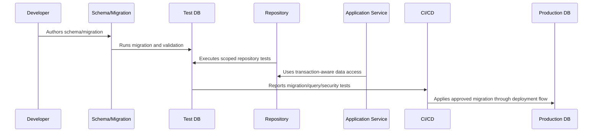

# Repository Integration with Database

> *"Defines how backend repositories integrate with the database through scoped queries, transaction context, mapping, and error handling."*

---

# Purpose

Defines how backend repositories integrate with the database through scoped queries, transaction context, mapping, and error handling.

---

# Database Problem

When application code directly spreads database access everywhere, authorization and tenant boundaries become inconsistent.

---

# Database Decision

## Decision

CLARA repositories should isolate database details from application services while enforcing safe query boundaries and predictable data shapes.

## Status

Accepted.

---

# Database Implementation Rule

Every CLARA database-backed capability should be implemented as:

```text
Schema -> Constraints -> Migration -> Repository -> Scoped Query -> Transaction/Consistency Rule -> Observability -> Tests -> Restore Compatibility
```

A database change is not production-ready if it cannot answer:

```text
what data it owns
what constraints protect correctness
how tenant/workspace scope is enforced
how migration runs safely
how rollback/forward-fix works
how queries perform at expected scale
how sensitive data is protected
how data is retained/deleted
how restore validation works
what tests prove the behavior
```

---

# Recommended Database Flow



---

# Production-Ready Checklist

- [ ] Schema naming is clear.
- [ ] Constraints protect critical invariants.
- [ ] Migration is reviewed.
- [ ] Migration is tested.
- [ ] Queries are tenant/workspace scoped.
- [ ] Data access is parameterized.
- [ ] Transactions are explicit where needed.
- [ ] Indexes support critical queries.
- [ ] Sensitive data is protected.
- [ ] Restore compatibility is considered.

---

# Acceptance Criteria

- [ ] Data model is understandable.
- [ ] Migration is safe enough for production.
- [ ] Scoping prevents cross-tenant access.
- [ ] Query performance is considered.
- [ ] Data lifecycle rules are clear.
- [ ] Database security expectations are clear.
- [ ] AI coding assistants can follow this safely.

---

# Anti-patterns

Avoid:

- Migrations that run only on empty databases.
- Unbounded list queries.
- Missing organization/workspace scope.
- Storing secrets in plain database columns without protection strategy.
- Business-critical invariants only in comments.
- Large table rewrites during peak traffic.
- Using production data as local seed data.
- Deleting data with no audit trail when audit is required.
- Repository methods returning data across tenants.
- Tests that do not include wrong-workspace cases.

---

# Related Documents

- ../PART-03-Backend-Implementation/README.md
- ../PART-02-Repository-and-Module-Implementation/README.md
- ../../BOOK-06-Security-Governance-and-Compliance/BOOK-06-Master-Index/README.md
- ../../BOOK-07-Operations-Observability-and-Reliability/PART-07-Backup-Restore-and-Disaster-Recovery/README.md
- ../../BOOK-07-Operations-Observability-and-Reliability/PART-06-Performance-and-Capacity/README.md

---

# Navigation

**Previous:** `52-Seed-Data-and-Fixture-Strategy.md`

**Next:** `54-Tenant-and-Workspace-Scoping.md`

---

# Repository Pattern

Recommended repository contract:

```text
interface TicketRepository {
  findByIdScoped(workspaceId, ticketId)
  listByCustomerScoped(workspaceId, customerId, pagination)
  create(data, transaction?)
  updateStatusScoped(workspaceId, ticketId, status, transaction?)
}
```

---

# Repository Responsibilities

Repositories should:

```text
hide database implementation details
enforce scope in query methods
return application/domain-safe shapes
support transaction context
map known database errors
avoid leaking raw SQL/ORM exceptions
```

---

# Repository Naming Rule

Prefer method names that reveal scope:

```text
findByIdScoped
listForWorkspace
updateForOrganization
```

Avoid ambiguous methods:

```text
findById
getAll
updateAny
```

---

# Data Access Rule

Application services should not build ad-hoc SQL across the codebase.
