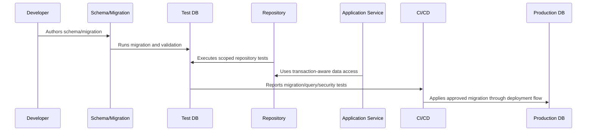

# Indexing and Query Performance Implementation

> *"Defines indexing strategy, query shape review, slow query analysis, pagination, search performance, and production query safeguards."*

---

# Purpose

Defines indexing strategy, query shape review, slow query analysis, pagination, search performance, and production query safeguards.

---

# Database Problem

A query that is fast with seed data can become an incident with production-scale data.

---

# Database Decision

## Decision

CLARA database implementation should include indexes and query patterns that match critical workflows and expected growth.

## Status

Accepted.

---

# Database Implementation Rule

Every CLARA database-backed capability should be implemented as:

```text
Schema -> Constraints -> Migration -> Repository -> Scoped Query -> Transaction/Consistency Rule -> Observability -> Tests -> Restore Compatibility
```

A database change is not production-ready if it cannot answer:

```text
what data it owns
what constraints protect correctness
how tenant/workspace scope is enforced
how migration runs safely
how rollback/forward-fix works
how queries perform at expected scale
how sensitive data is protected
how data is retained/deleted
how restore validation works
what tests prove the behavior
```

---

# Recommended Database Flow



---

# Production-Ready Checklist

- [ ] Schema naming is clear.
- [ ] Constraints protect critical invariants.
- [ ] Migration is reviewed.
- [ ] Migration is tested.
- [ ] Queries are tenant/workspace scoped.
- [ ] Data access is parameterized.
- [ ] Transactions are explicit where needed.
- [ ] Indexes support critical queries.
- [ ] Sensitive data is protected.
- [ ] Restore compatibility is considered.

---

# Acceptance Criteria

- [ ] Data model is understandable.
- [ ] Migration is safe enough for production.
- [ ] Scoping prevents cross-tenant access.
- [ ] Query performance is considered.
- [ ] Data lifecycle rules are clear.
- [ ] Database security expectations are clear.
- [ ] AI coding assistants can follow this safely.

---

# Anti-patterns

Avoid:

- Migrations that run only on empty databases.
- Unbounded list queries.
- Missing organization/workspace scope.
- Storing secrets in plain database columns without protection strategy.
- Business-critical invariants only in comments.
- Large table rewrites during peak traffic.
- Using production data as local seed data.
- Deleting data with no audit trail when audit is required.
- Repository methods returning data across tenants.
- Tests that do not include wrong-workspace cases.

---

# Related Documents

- ../PART-03-Backend-Implementation/README.md
- ../PART-02-Repository-and-Module-Implementation/README.md
- ../../BOOK-06-Security-Governance-and-Compliance/BOOK-06-Master-Index/README.md
- ../../BOOK-07-Operations-Observability-and-Reliability/PART-07-Backup-Restore-and-Disaster-Recovery/README.md
- ../../BOOK-07-Operations-Observability-and-Reliability/PART-06-Performance-and-Capacity/README.md

---

# Navigation

**Previous:** `54-Tenant-and-Workspace-Scoping.md`

**Next:** `56-Transaction-and-Consistency-Patterns.md`

---

# Indexing Strategy

Create indexes for:

```text
foreign keys used in joins
workspace_id + created_at
organization_id + created_at
status + updated_at for queues/workflows
provider + external_id for integrations
idempotency keys
audit event lookup fields
search/filter fields used by critical workflows
```

---

# Query Review Checklist

- [ ] Query is scoped.
- [ ] Query uses expected index.
- [ ] Query has bounded result set.
- [ ] Query avoids N+1 patterns.
- [ ] Query avoids unnecessary wide selects.
- [ ] Pagination is implemented.
- [ ] Query latency is observable.
- [ ] Query shape is tested with realistic data.

---

# Pagination Rule

Any endpoint or repository method returning lists must define limit and pagination behavior.

---

# Performance Rule

Indexing should follow real query patterns, not guesswork alone.
