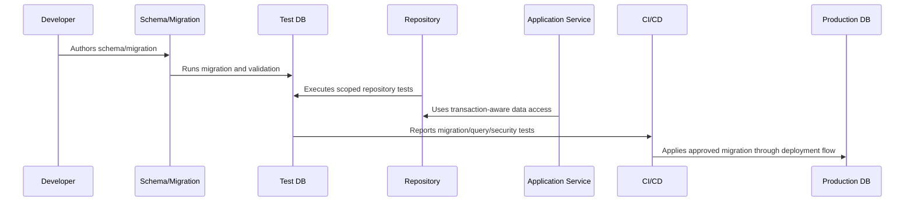

# Transaction and Consistency Patterns

> *"Defines transaction boundaries, consistency rules, idempotency support, outbox patterns, conflict handling, and partial failure strategy."*

---

# Purpose

Defines transaction boundaries, consistency rules, idempotency support, outbox patterns, conflict handling, and partial failure strategy.

---

# Database Problem

Distributed workflows fail when database commits, queue jobs, and provider calls are not coordinated safely.

---

# Database Decision

## Decision

CLARA data mutations should use explicit transactions and consistency patterns that prevent duplicate side effects and corrupted state.

## Status

Accepted.

---

# Database Implementation Rule

Every CLARA database-backed capability should be implemented as:

```text
Schema -> Constraints -> Migration -> Repository -> Scoped Query -> Transaction/Consistency Rule -> Observability -> Tests -> Restore Compatibility
```

A database change is not production-ready if it cannot answer:

```text
what data it owns
what constraints protect correctness
how tenant/workspace scope is enforced
how migration runs safely
how rollback/forward-fix works
how queries perform at expected scale
how sensitive data is protected
how data is retained/deleted
how restore validation works
what tests prove the behavior
```

---

# Recommended Database Flow



---

# Production-Ready Checklist

- [ ] Schema naming is clear.
- [ ] Constraints protect critical invariants.
- [ ] Migration is reviewed.
- [ ] Migration is tested.
- [ ] Queries are tenant/workspace scoped.
- [ ] Data access is parameterized.
- [ ] Transactions are explicit where needed.
- [ ] Indexes support critical queries.
- [ ] Sensitive data is protected.
- [ ] Restore compatibility is considered.

---

# Acceptance Criteria

- [ ] Data model is understandable.
- [ ] Migration is safe enough for production.
- [ ] Scoping prevents cross-tenant access.
- [ ] Query performance is considered.
- [ ] Data lifecycle rules are clear.
- [ ] Database security expectations are clear.
- [ ] AI coding assistants can follow this safely.

---

# Anti-patterns

Avoid:

- Migrations that run only on empty databases.
- Unbounded list queries.
- Missing organization/workspace scope.
- Storing secrets in plain database columns without protection strategy.
- Business-critical invariants only in comments.
- Large table rewrites during peak traffic.
- Using production data as local seed data.
- Deleting data with no audit trail when audit is required.
- Repository methods returning data across tenants.
- Tests that do not include wrong-workspace cases.

---

# Related Documents

- ../PART-03-Backend-Implementation/README.md
- ../PART-02-Repository-and-Module-Implementation/README.md
- ../../BOOK-06-Security-Governance-and-Compliance/BOOK-06-Master-Index/README.md
- ../../BOOK-07-Operations-Observability-and-Reliability/PART-07-Backup-Restore-and-Disaster-Recovery/README.md
- ../../BOOK-07-Operations-Observability-and-Reliability/PART-06-Performance-and-Capacity/README.md

---

# Navigation

**Previous:** `55-Indexing-and-Query-Performance-Implementation.md`

**Next:** `57-Audit-Data-Retention-and-Deletion-Implementation.md`

---

# Transaction Patterns

Use transactions for:

```text
multi-table state changes
ticket status + ticket event write
conversation reply record + outbox event
integration event process + domain mutation
audit event + sensitive action where consistency is required
idempotency key + mutation result
```

---

# Outbox Pattern

For reliable async side effects:

```text
1 write domain change and outbox event in same DB transaction
2 worker reads outbox
3 worker sends external/queue event
4 mark outbox processed idempotently
```

---

# Conflict Handling

Use:

```text
unique constraints
optimistic locking/version columns
idempotency records
retry with backoff for safe conflicts
explicit 409 Conflict responses
```

---

# Consistency Rule

Do not hold database transactions while waiting on slow external providers unless there is a documented reason.
