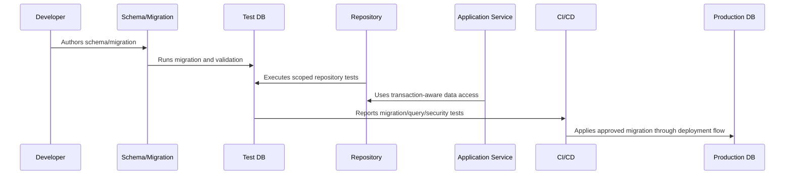

# Backup Restore and DR Compatibility

> *"Defines how database design and migrations must support backup, restore, point-in-time recovery, restore validation, and disaster recovery."*

---

# Purpose

Defines how database design and migrations must support backup, restore, point-in-time recovery, restore validation, and disaster recovery.

---

# Database Problem

Backup and restore plans fail when schema, migrations, and operational validation are not designed together.

---

# Database Decision

## Decision

CLARA database implementation should be compatible with restore procedures, integrity checks, migration replay, and DR evidence requirements.

## Status

Accepted.

---

# Database Implementation Rule

Every CLARA database-backed capability should be implemented as:

```text
Schema -> Constraints -> Migration -> Repository -> Scoped Query -> Transaction/Consistency Rule -> Observability -> Tests -> Restore Compatibility
```

A database change is not production-ready if it cannot answer:

```text
what data it owns
what constraints protect correctness
how tenant/workspace scope is enforced
how migration runs safely
how rollback/forward-fix works
how queries perform at expected scale
how sensitive data is protected
how data is retained/deleted
how restore validation works
what tests prove the behavior
```

---

# Recommended Database Flow



---

# Production-Ready Checklist

- [ ] Schema naming is clear.
- [ ] Constraints protect critical invariants.
- [ ] Migration is reviewed.
- [ ] Migration is tested.
- [ ] Queries are tenant/workspace scoped.
- [ ] Data access is parameterized.
- [ ] Transactions are explicit where needed.
- [ ] Indexes support critical queries.
- [ ] Sensitive data is protected.
- [ ] Restore compatibility is considered.

---

# Acceptance Criteria

- [ ] Data model is understandable.
- [ ] Migration is safe enough for production.
- [ ] Scoping prevents cross-tenant access.
- [ ] Query performance is considered.
- [ ] Data lifecycle rules are clear.
- [ ] Database security expectations are clear.
- [ ] AI coding assistants can follow this safely.

---

# Anti-patterns

Avoid:

- Migrations that run only on empty databases.
- Unbounded list queries.
- Missing organization/workspace scope.
- Storing secrets in plain database columns without protection strategy.
- Business-critical invariants only in comments.
- Large table rewrites during peak traffic.
- Using production data as local seed data.
- Deleting data with no audit trail when audit is required.
- Repository methods returning data across tenants.
- Tests that do not include wrong-workspace cases.

---

# Related Documents

- ../PART-03-Backend-Implementation/README.md
- ../PART-02-Repository-and-Module-Implementation/README.md
- ../../BOOK-06-Security-Governance-and-Compliance/BOOK-06-Master-Index/README.md
- ../../BOOK-07-Operations-Observability-and-Reliability/PART-07-Backup-Restore-and-Disaster-Recovery/README.md
- ../../BOOK-07-Operations-Observability-and-Reliability/PART-06-Performance-and-Capacity/README.md

---

# Navigation

**Previous:** `57-Audit-Data-Retention-and-Deletion-Implementation.md`

**Next:** `59-Database-Security-and-Access-Control.md`

---

# Restore Compatibility Requirements

Database implementation should support:

```text
full restore
point-in-time recovery
migration replay/compatibility
schema version identification
integrity validation
workspace-level smoke checks
file metadata consistency checks
audit continuity where possible
```

---

# Restore Validation Queries

Create validation checks for:

```text
critical table row counts
foreign key integrity
workspace/customer/conversation/ticket consistency
membership/permission consistency
integration event state
attachment metadata references
migration version
recent audit events
```

---

# DR Compatibility Rule

Every migration should consider whether it affects backup restore, point-in-time recovery, or restore validation.
