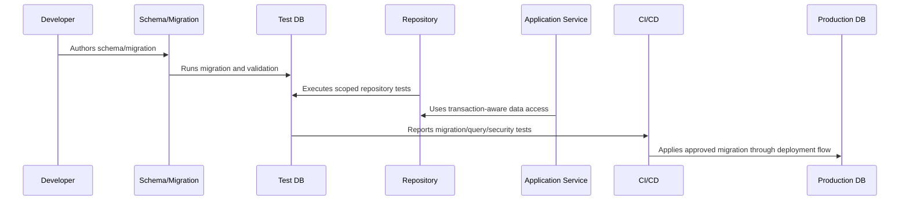

# Database Security and Access Control

> *"Defines database access security, least privilege, service accounts, admin access, encryption, sensitive columns, masking, and operational safeguards."*

---

# Purpose

Defines database access security, least privilege, service accounts, admin access, encryption, sensitive columns, masking, and operational safeguards.

---

# Database Problem

Database access is one of the highest-risk operational surfaces in a SaaS system.

---

# Database Decision

## Decision

CLARA database access should be least-privilege, environment-scoped, audited for sensitive operations, and protected against direct unsafe access.

## Status

Accepted.

---

# Database Implementation Rule

Every CLARA database-backed capability should be implemented as:

```text
Schema -> Constraints -> Migration -> Repository -> Scoped Query -> Transaction/Consistency Rule -> Observability -> Tests -> Restore Compatibility
```

A database change is not production-ready if it cannot answer:

```text
what data it owns
what constraints protect correctness
how tenant/workspace scope is enforced
how migration runs safely
how rollback/forward-fix works
how queries perform at expected scale
how sensitive data is protected
how data is retained/deleted
how restore validation works
what tests prove the behavior
```

---

# Recommended Database Flow



---

# Production-Ready Checklist

- [ ] Schema naming is clear.
- [ ] Constraints protect critical invariants.
- [ ] Migration is reviewed.
- [ ] Migration is tested.
- [ ] Queries are tenant/workspace scoped.
- [ ] Data access is parameterized.
- [ ] Transactions are explicit where needed.
- [ ] Indexes support critical queries.
- [ ] Sensitive data is protected.
- [ ] Restore compatibility is considered.

---

# Acceptance Criteria

- [ ] Data model is understandable.
- [ ] Migration is safe enough for production.
- [ ] Scoping prevents cross-tenant access.
- [ ] Query performance is considered.
- [ ] Data lifecycle rules are clear.
- [ ] Database security expectations are clear.
- [ ] AI coding assistants can follow this safely.

---

# Anti-patterns

Avoid:

- Migrations that run only on empty databases.
- Unbounded list queries.
- Missing organization/workspace scope.
- Storing secrets in plain database columns without protection strategy.
- Business-critical invariants only in comments.
- Large table rewrites during peak traffic.
- Using production data as local seed data.
- Deleting data with no audit trail when audit is required.
- Repository methods returning data across tenants.
- Tests that do not include wrong-workspace cases.

---

# Related Documents

- ../PART-03-Backend-Implementation/README.md
- ../PART-02-Repository-and-Module-Implementation/README.md
- ../../BOOK-06-Security-Governance-and-Compliance/BOOK-06-Master-Index/README.md
- ../../BOOK-07-Operations-Observability-and-Reliability/PART-07-Backup-Restore-and-Disaster-Recovery/README.md
- ../../BOOK-07-Operations-Observability-and-Reliability/PART-06-Performance-and-Capacity/README.md

---

# Navigation

**Previous:** `58-Backup-Restore-and-DR-Compatibility.md`

**Next:** `60-Database-Testing-and-Readiness-Checklist.md`

---

# Database Access Roles

Recommended role types:

```text
application runtime role
migration role
read-only analytics role
support diagnostic role
admin/break-glass role
backup/restore role
CI test role
```

---

# Access Control Rules

```text
least privilege
separate production and non-production credentials
no shared personal database users where avoidable
admin access audited
service account ownership documented
credentials rotated on trigger/cadence
```

---

# Sensitive Data Handling

For sensitive columns:

```text
minimize storage
encrypt where required
mask in logs/tools
restrict direct access
avoid selecting unless needed
avoid exposing through generic admin views
```

---

# Security Rule

Database credentials are production secrets and must never be committed or pasted into docs/tickets/chat.
