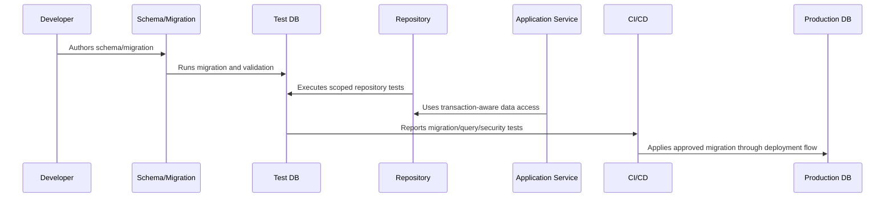

# Database Testing and Readiness Checklist

> *"Defines database testing and readiness standards for migrations, repositories, scoping, constraints, transactions, performance, security, and restore validation."*

---

# Purpose

Defines database testing and readiness standards for migrations, repositories, scoping, constraints, transactions, performance, security, and restore validation.

---

# Database Problem

A database schema is not production-ready just because migrations run successfully once.

---

# Database Decision

## Decision

CLARA database implementation should not be considered ready until migrations, queries, access boundaries, performance, security, and restore compatibility are tested.

## Status

Accepted.

---

# Database Implementation Rule

Every CLARA database-backed capability should be implemented as:

```text
Schema -> Constraints -> Migration -> Repository -> Scoped Query -> Transaction/Consistency Rule -> Observability -> Tests -> Restore Compatibility
```

A database change is not production-ready if it cannot answer:

```text
what data it owns
what constraints protect correctness
how tenant/workspace scope is enforced
how migration runs safely
how rollback/forward-fix works
how queries perform at expected scale
how sensitive data is protected
how data is retained/deleted
how restore validation works
what tests prove the behavior
```

---

# Recommended Database Flow



---

# Production-Ready Checklist

- [ ] Schema naming is clear.
- [ ] Constraints protect critical invariants.
- [ ] Migration is reviewed.
- [ ] Migration is tested.
- [ ] Queries are tenant/workspace scoped.
- [ ] Data access is parameterized.
- [ ] Transactions are explicit where needed.
- [ ] Indexes support critical queries.
- [ ] Sensitive data is protected.
- [ ] Restore compatibility is considered.

---

# Acceptance Criteria

- [ ] Data model is understandable.
- [ ] Migration is safe enough for production.
- [ ] Scoping prevents cross-tenant access.
- [ ] Query performance is considered.
- [ ] Data lifecycle rules are clear.
- [ ] Database security expectations are clear.
- [ ] AI coding assistants can follow this safely.

---

# Anti-patterns

Avoid:

- Migrations that run only on empty databases.
- Unbounded list queries.
- Missing organization/workspace scope.
- Storing secrets in plain database columns without protection strategy.
- Business-critical invariants only in comments.
- Large table rewrites during peak traffic.
- Using production data as local seed data.
- Deleting data with no audit trail when audit is required.
- Repository methods returning data across tenants.
- Tests that do not include wrong-workspace cases.

---

# Related Documents

- ../PART-03-Backend-Implementation/README.md
- ../PART-02-Repository-and-Module-Implementation/README.md
- ../../BOOK-06-Security-Governance-and-Compliance/BOOK-06-Master-Index/README.md
- ../../BOOK-07-Operations-Observability-and-Reliability/PART-07-Backup-Restore-and-Disaster-Recovery/README.md
- ../../BOOK-07-Operations-Observability-and-Reliability/PART-06-Performance-and-Capacity/README.md

---

# Navigation

**Previous:** `59-Database-Security-and-Access-Control.md`

**Next:** `../PART-06-AI-Gateway-and-Automation-Implementation/README.md`

---

# Database Test Types

Implement:

```text
migration tests
repository integration tests
tenant/workspace isolation tests
constraint tests
transaction tests
idempotency tests
query performance smoke tests
retention/deletion tests
audit event tests
restore validation tests where practical
```

---

# Readiness Checklist

- [ ] Schema is reviewed.
- [ ] Constraints protect critical invariants.
- [ ] Migrations run on clean DB.
- [ ] Migrations run on realistic existing data.
- [ ] Repository methods enforce scope.
- [ ] Authorization-sensitive queries have tests.
- [ ] Indexes exist for critical paths.
- [ ] Slow query risks are reviewed.
- [ ] Transactions are explicit.
- [ ] Retention/deletion behavior is tested.
- [ ] Backup/restore compatibility is considered.
- [ ] Database access roles are documented.

---

# Part 05 Completion

Part 05 establishes:

- Database and migration implementation overview.
- Schema implementation standards.
- Migration workflow and safety.
- Seed data and fixture strategy.
- Repository integration with database.
- Tenant and workspace scoping.
- Indexing and query performance implementation.
- Transaction and consistency patterns.
- Audit, data retention, and deletion implementation.
- Backup, restore, and DR compatibility.
- Database security and access control.
- Database testing and readiness checklist.

---

# Ready for Part 06

The next part should be:

```text
BOOK VIII — PART 06: AI Gateway and Automation Implementation
```

It should define:

- AI Gateway implementation overview.
- Provider adapter implementation.
- Prompt/template implementation.
- Context/RAG implementation.
- AI safety implementation.
- Human review implementation.
- AI observability and cost tracking.
- Automation workflow implementation.
- AI fallback/kill switch implementation.
- AI testing and readiness.
