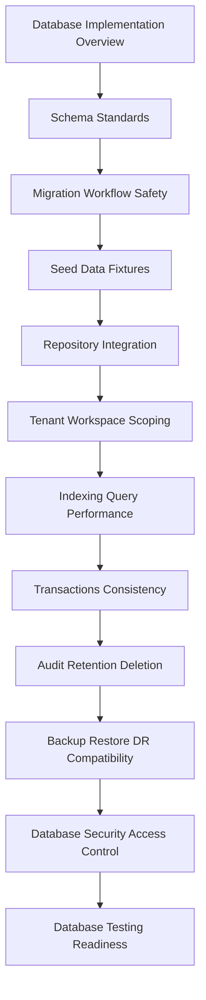

# PART-05 — Database and Migration Implementation

> *"The database is where product behavior becomes durable truth."*

---

# Purpose

Part 05 defines CLARA's database and migration implementation standards.

It covers:

- Database and Migration Implementation overview.
- Schema Implementation Standards.
- Migration Workflow and Safety.
- Seed Data and Fixture Strategy.
- Repository Integration with Database.
- Tenant and Workspace Scoping.
- Indexing and Query Performance Implementation.
- Transaction and Consistency Patterns.
- Audit, Data Retention, and Deletion Implementation.
- Backup, Restore, and DR Compatibility.
- Database Security and Access Control.
- Database Testing and Readiness Checklist.

---

# Chapter Map

| Chapter | Title |
|---:|---|
| 49 | Database and Migration Implementation Overview |
| 50 | Schema Implementation Standards |
| 51 | Migration Workflow and Safety |
| 52 | Seed Data and Fixture Strategy |
| 53 | Repository Integration with Database |
| 54 | Tenant and Workspace Scoping |
| 55 | Indexing and Query Performance Implementation |
| 56 | Transaction and Consistency Patterns |
| 57 | Audit Data Retention and Deletion Implementation |
| 58 | Backup Restore and DR Compatibility |
| 59 | Database Security and Access Control |
| 60 | Database Testing and Readiness Checklist |

---

# Database Implementation Map



---

# Database Non-Negotiables

CLARA database implementation must enforce:

```text
explicit schema naming
foreign key and uniqueness constraints where appropriate
tenant/workspace scoping
parameterized queries
safe migrations
tested migrations
no production data in local seed
transaction boundaries
idempotency support
indexing for critical queries
pagination for large reads
audit data design
retention/deletion rules
backup/restore compatibility
least-privilege database access
database readiness tests
```

---

# Relationship to Previous Parts

Part 03 defines backend implementation.

Part 05 defines the data layer implementation that backend modules depend on.

---

# Navigation

**Previous:** `../PART-04-Frontend-and-Client-Implementation/48-Frontend-Testing-and-Readiness-Checklist.md`

**Next:** `49-Database-and-Migration-Implementation-Overview.md`
