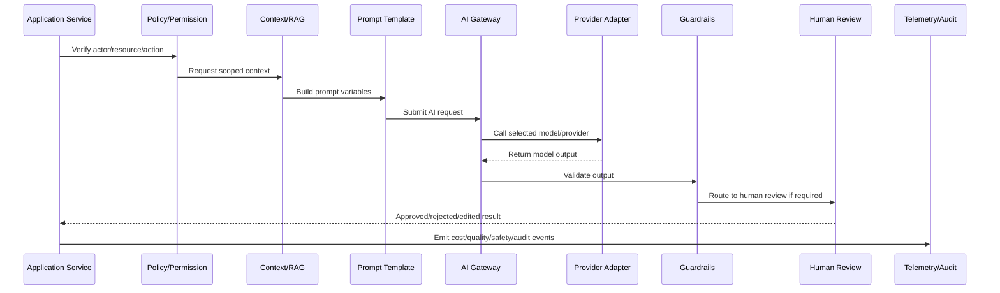

# AI Gateway and Automation Implementation Overview

> *"Introduces CLARA's AI Gateway and automation implementation model for building safe, observable, reviewable, cost-aware, and production-ready AI workflows."*

---

# Purpose

Introduces CLARA's AI Gateway and automation implementation model for building safe, observable, reviewable, cost-aware, and production-ready AI workflows.

---

# AI/Automation Problem

AI features become risky when every module calls providers directly with inconsistent prompts, missing safety controls, no cost tracking, and no review boundary.

---

# AI/Automation Decision

## Decision

CLARA should route AI usage through an AI Gateway that centralizes provider access, prompts, safety controls, context retrieval, observability, cost tracking, fallback behavior, and human review workflows.

## Status

Accepted.

---

# AI Gateway Implementation Rule

Every CLARA AI or automation capability should be implemented as:

```text
Use Case -> Policy Check -> Context Assembly -> Prompt Template -> AI Gateway -> Provider Adapter -> Guardrails -> Review/Approval -> Action/Response -> Telemetry -> Audit -> Tests
```

An AI/automation change is not production-ready if it cannot answer:

```text
what user/business workflow it supports
what model/provider it uses
what prompt/template version it uses
what context it can access
how tenant/workspace scope is enforced
what safety checks run before and after the model call
whether human review is required
what action can be taken automatically
how cost is tracked
how output quality is evaluated
how the feature can be disabled
what tests prove safe behavior
```

---

# Recommended AI Workflow



---

# Production-Ready Checklist

- [ ] AI call goes through AI Gateway.
- [ ] Provider adapter is isolated.
- [ ] Prompt template is versioned.
- [ ] Context is tenant/workspace scoped.
- [ ] Prompt injection risk is reviewed.
- [ ] Sensitive data exposure is minimized.
- [ ] Output guardrails exist.
- [ ] Human review exists where needed.
- [ ] Cost/token tracking exists.
- [ ] Fallback/kill switch exists.
- [ ] Tests cover failure and abuse cases.
- [ ] Runbook/operational notes exist.

---

# Acceptance Criteria

- [ ] AI workflow boundary is explicit.
- [ ] Safety controls are implemented.
- [ ] Cost and quality can be measured.
- [ ] Human review and approval are supported.
- [ ] Automation is idempotent and auditable.
- [ ] Failure modes degrade safely.
- [ ] AI coding assistants can apply this safely.

---

# Anti-patterns

Avoid:

- Calling AI providers directly from random modules.
- Hard-coding prompts in controllers.
- Sending unscoped customer data to AI.
- Trusting model output without validation.
- Letting AI execute high-impact actions without approval.
- Logging raw prompts/responses containing sensitive data.
- No model/provider timeout.
- No cost tracking.
- No kill switch.
- No prompt/version history.
- No adversarial/prompt injection tests.

---

# Related Documents

- ../PART-03-Backend-Implementation/README.md
- ../PART-05-Database-and-Migration-Implementation/README.md
- ../../BOOK-06-Security-Governance-and-Compliance/BOOK-06-Master-Index/README.md
- ../../BOOK-07-Operations-Observability-and-Reliability/PART-02-Observability-Strategy/README.md
- ../../BOOK-07-Operations-Observability-and-Reliability/PART-05-Reliability-Engineering/README.md

---

# Navigation

**Previous:** `../PART-05-Database-and-Migration-Implementation/60-Database-Testing-and-Readiness-Checklist.md`

**Next:** `62-AI-Gateway-Service-Bootstrap.md`

---

# AI Gateway Scope

CLARA AI Gateway should cover:

```text
reply draft generation
conversation summarization
ticket classification
sentiment/intent detection
knowledge retrieval assistance
support recommendation
automation suggestion
workflow action proposal
quality/safety evaluation
```

---

# Automation Scope

Automation should cover:

```text
routing
tagging
assignment suggestions
status updates after approval
follow-up reminders
integration event processing
AI-assisted reply drafting
knowledge suggestion
support escalation triggers
```

---

# Guiding Question

```text
Can this AI/automation behavior be explained, reviewed, measured, disabled, and safely recovered from?
```
