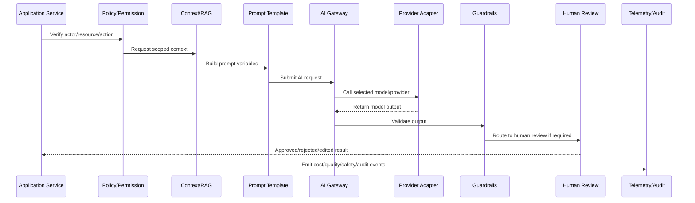

# AI Gateway Service Bootstrap

> *"Defines AI Gateway bootstrap standards including configuration, provider registration, model routing, safety policy loading, telemetry, health checks, and graceful shutdown."*

---

# Purpose

Defines AI Gateway bootstrap standards including configuration, provider registration, model routing, safety policy loading, telemetry, health checks, and graceful shutdown.

---

# AI/Automation Problem

An AI Gateway that starts with incomplete config or unsafe defaults can generate incorrect, costly, or unauthorized outputs.

---

# AI/Automation Decision

## Decision

CLARA AI Gateway should start with validated config, explicit provider/model availability, loaded safety policies, initialized telemetry, and fail-closed behavior for missing critical controls.

## Status

Accepted.

---

# AI Gateway Implementation Rule

Every CLARA AI or automation capability should be implemented as:

```text
Use Case -> Policy Check -> Context Assembly -> Prompt Template -> AI Gateway -> Provider Adapter -> Guardrails -> Review/Approval -> Action/Response -> Telemetry -> Audit -> Tests
```

An AI/automation change is not production-ready if it cannot answer:

```text
what user/business workflow it supports
what model/provider it uses
what prompt/template version it uses
what context it can access
how tenant/workspace scope is enforced
what safety checks run before and after the model call
whether human review is required
what action can be taken automatically
how cost is tracked
how output quality is evaluated
how the feature can be disabled
what tests prove safe behavior
```

---

# Recommended AI Workflow



---

# Production-Ready Checklist

- [ ] AI call goes through AI Gateway.
- [ ] Provider adapter is isolated.
- [ ] Prompt template is versioned.
- [ ] Context is tenant/workspace scoped.
- [ ] Prompt injection risk is reviewed.
- [ ] Sensitive data exposure is minimized.
- [ ] Output guardrails exist.
- [ ] Human review exists where needed.
- [ ] Cost/token tracking exists.
- [ ] Fallback/kill switch exists.
- [ ] Tests cover failure and abuse cases.
- [ ] Runbook/operational notes exist.

---

# Acceptance Criteria

- [ ] AI workflow boundary is explicit.
- [ ] Safety controls are implemented.
- [ ] Cost and quality can be measured.
- [ ] Human review and approval are supported.
- [ ] Automation is idempotent and auditable.
- [ ] Failure modes degrade safely.
- [ ] AI coding assistants can apply this safely.

---

# Anti-patterns

Avoid:

- Calling AI providers directly from random modules.
- Hard-coding prompts in controllers.
- Sending unscoped customer data to AI.
- Trusting model output without validation.
- Letting AI execute high-impact actions without approval.
- Logging raw prompts/responses containing sensitive data.
- No model/provider timeout.
- No cost tracking.
- No kill switch.
- No prompt/version history.
- No adversarial/prompt injection tests.

---

# Related Documents

- ../PART-03-Backend-Implementation/README.md
- ../PART-05-Database-and-Migration-Implementation/README.md
- ../../BOOK-06-Security-Governance-and-Compliance/BOOK-06-Master-Index/README.md
- ../../BOOK-07-Operations-Observability-and-Reliability/PART-02-Observability-Strategy/README.md
- ../../BOOK-07-Operations-Observability-and-Reliability/PART-05-Reliability-Engineering/README.md

---

# Navigation

**Previous:** `61-AI-Gateway-and-Automation-Implementation-Overview.md`

**Next:** `63-Provider-Adapter-Implementation.md`

---

# AI Gateway Bootstrap Responsibilities

AI Gateway bootstrap should:

```text
load validated config
load provider credentials from secret manager/environment
register enabled providers
register enabled models
load safety policies
load prompt registry
initialize telemetry
initialize rate limit/cost controls
register health/readiness checks
support graceful shutdown
```

---

# AI Config Inventory

Track:

```text
provider
model
purpose
enabled environments
timeout
max tokens
rate limit
cost limit
safety policy
fallback model/provider
owner
```

---

# Readiness Checks

```text
provider config present
safety policy loaded
prompt registry available
telemetry initialized
cost tracking initialized
kill switch state readable
```

---

# Bootstrap Rule

If safety policy or cost guard config is missing for a production AI feature, fail closed.
