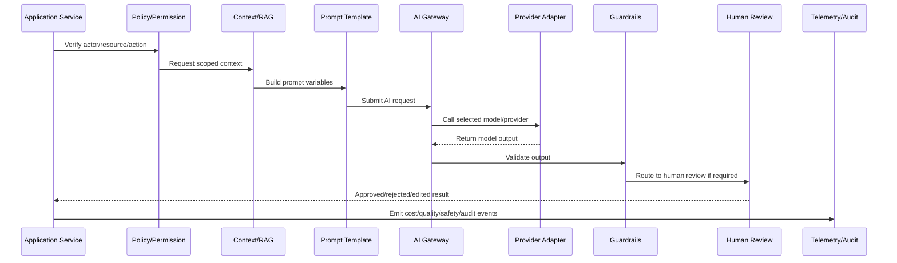
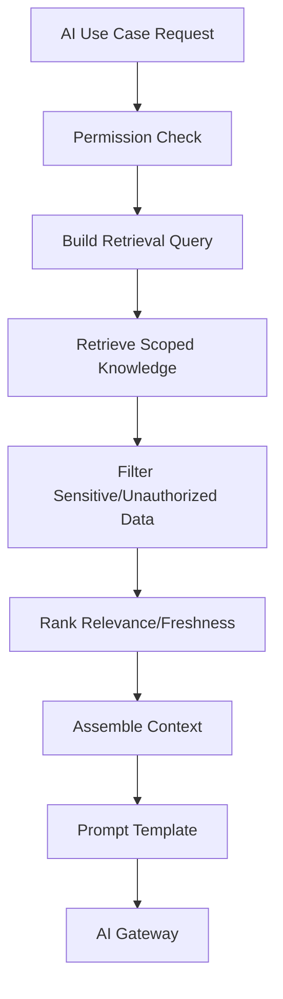

# Context and RAG Implementation

> *"Defines standards for context assembly, retrieval-augmented generation, knowledge source filtering, tenant/workspace scoping, citation/evidence handling, and context size control."*

---

# Purpose

Defines standards for context assembly, retrieval-augmented generation, knowledge source filtering, tenant/workspace scoping, citation/evidence handling, and context size control.

---

# AI/Automation Problem

AI output becomes unreliable and dangerous when context is stale, overbroad, unauthorized, or not traceable.

---

# AI/Automation Decision

## Decision

CLARA context/RAG implementation should retrieve only authorized, relevant, fresh-enough context and attach evidence that supports generated outputs.

## Status

Accepted.

---

# AI Gateway Implementation Rule

Every CLARA AI or automation capability should be implemented as:

```text
Use Case -> Policy Check -> Context Assembly -> Prompt Template -> AI Gateway -> Provider Adapter -> Guardrails -> Review/Approval -> Action/Response -> Telemetry -> Audit -> Tests
```

An AI/automation change is not production-ready if it cannot answer:

```text
what user/business workflow it supports
what model/provider it uses
what prompt/template version it uses
what context it can access
how tenant/workspace scope is enforced
what safety checks run before and after the model call
whether human review is required
what action can be taken automatically
how cost is tracked
how output quality is evaluated
how the feature can be disabled
what tests prove safe behavior
```

---

# Recommended AI Workflow



---

# Production-Ready Checklist

- [ ] AI call goes through AI Gateway.
- [ ] Provider adapter is isolated.
- [ ] Prompt template is versioned.
- [ ] Context is tenant/workspace scoped.
- [ ] Prompt injection risk is reviewed.
- [ ] Sensitive data exposure is minimized.
- [ ] Output guardrails exist.
- [ ] Human review exists where needed.
- [ ] Cost/token tracking exists.
- [ ] Fallback/kill switch exists.
- [ ] Tests cover failure and abuse cases.
- [ ] Runbook/operational notes exist.

---

# Acceptance Criteria

- [ ] AI workflow boundary is explicit.
- [ ] Safety controls are implemented.
- [ ] Cost and quality can be measured.
- [ ] Human review and approval are supported.
- [ ] Automation is idempotent and auditable.
- [ ] Failure modes degrade safely.
- [ ] AI coding assistants can apply this safely.

---

# Anti-patterns

Avoid:

- Calling AI providers directly from random modules.
- Hard-coding prompts in controllers.
- Sending unscoped customer data to AI.
- Trusting model output without validation.
- Letting AI execute high-impact actions without approval.
- Logging raw prompts/responses containing sensitive data.
- No model/provider timeout.
- No cost tracking.
- No kill switch.
- No prompt/version history.
- No adversarial/prompt injection tests.

---

# Related Documents

- ../PART-03-Backend-Implementation/README.md
- ../PART-05-Database-and-Migration-Implementation/README.md
- ../../BOOK-06-Security-Governance-and-Compliance/BOOK-06-Master-Index/README.md
- ../../BOOK-07-Operations-Observability-and-Reliability/PART-02-Observability-Strategy/README.md
- ../../BOOK-07-Operations-Observability-and-Reliability/PART-05-Reliability-Engineering/README.md

---

# Navigation

**Previous:** `64-Prompt-and-Template-Implementation.md`

**Next:** `66-AI-Safety-and-Guardrail-Implementation.md`

---

# Context Assembly Responsibilities

Context assembly should:

```text
check actor permission
filter by workspace/tenant
retrieve relevant records
limit context size
remove unnecessary sensitive fields
include source references
rank freshness/relevance
label untrusted content
```

---

# RAG Pipeline



---

# Context Source Examples

```text
conversation messages
customer profile
ticket history
workspace knowledge base
approved macros
integration metadata
policy/config references
```

---

# RAG Security Rule

Never retrieve or inject context the actor is not authorized to access.
