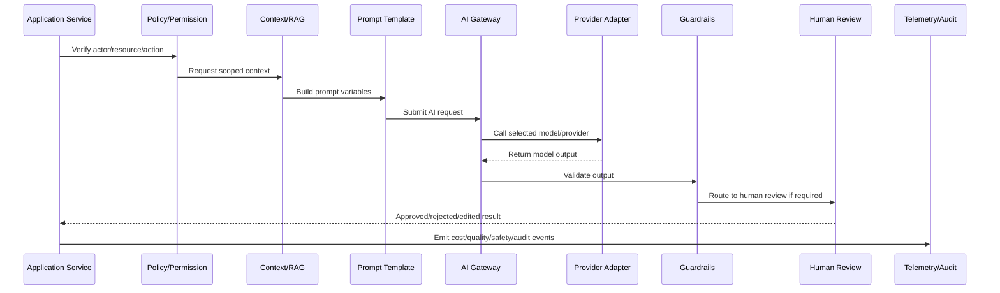

# AI Fallback Kill Switch and Degraded Mode

> *"Defines fallback, degraded mode, provider failover, model downgrade, feature flags, emergency disablement, and customer/support communication behavior."*

---

# Purpose

Defines fallback, degraded mode, provider failover, model downgrade, feature flags, emergency disablement, and customer/support communication behavior.

---

# AI/Automation Problem

AI/provider incidents should not make the entire product unusable.

---

# AI/Automation Decision

## Decision

CLARA AI and automation features should degrade safely, fail closed where needed, and support rapid disablement without taking down core product workflows.

## Status

Accepted.

---

# AI Gateway Implementation Rule

Every CLARA AI or automation capability should be implemented as:

```text
Use Case -> Policy Check -> Context Assembly -> Prompt Template -> AI Gateway -> Provider Adapter -> Guardrails -> Review/Approval -> Action/Response -> Telemetry -> Audit -> Tests
```

An AI/automation change is not production-ready if it cannot answer:

```text
what user/business workflow it supports
what model/provider it uses
what prompt/template version it uses
what context it can access
how tenant/workspace scope is enforced
what safety checks run before and after the model call
whether human review is required
what action can be taken automatically
how cost is tracked
how output quality is evaluated
how the feature can be disabled
what tests prove safe behavior
```

---

# Recommended AI Workflow



---

# Production-Ready Checklist

- [ ] AI call goes through AI Gateway.
- [ ] Provider adapter is isolated.
- [ ] Prompt template is versioned.
- [ ] Context is tenant/workspace scoped.
- [ ] Prompt injection risk is reviewed.
- [ ] Sensitive data exposure is minimized.
- [ ] Output guardrails exist.
- [ ] Human review exists where needed.
- [ ] Cost/token tracking exists.
- [ ] Fallback/kill switch exists.
- [ ] Tests cover failure and abuse cases.
- [ ] Runbook/operational notes exist.

---

# Acceptance Criteria

- [ ] AI workflow boundary is explicit.
- [ ] Safety controls are implemented.
- [ ] Cost and quality can be measured.
- [ ] Human review and approval are supported.
- [ ] Automation is idempotent and auditable.
- [ ] Failure modes degrade safely.
- [ ] AI coding assistants can apply this safely.

---

# Anti-patterns

Avoid:

- Calling AI providers directly from random modules.
- Hard-coding prompts in controllers.
- Sending unscoped customer data to AI.
- Trusting model output without validation.
- Letting AI execute high-impact actions without approval.
- Logging raw prompts/responses containing sensitive data.
- No model/provider timeout.
- No cost tracking.
- No kill switch.
- No prompt/version history.
- No adversarial/prompt injection tests.

---

# Related Documents

- ../PART-03-Backend-Implementation/README.md
- ../PART-05-Database-and-Migration-Implementation/README.md
- ../../BOOK-06-Security-Governance-and-Compliance/BOOK-06-Master-Index/README.md
- ../../BOOK-07-Operations-Observability-and-Reliability/PART-02-Observability-Strategy/README.md
- ../../BOOK-07-Operations-Observability-and-Reliability/PART-05-Reliability-Engineering/README.md

---

# Navigation

**Previous:** `69-Automation-Workflow-Implementation.md`

**Next:** `71-AI-and-Automation-Testing-Readiness.md`

---

# Fallback Strategies

Use:

```text
provider failover
model downgrade
manual workflow fallback
cached safe response where appropriate
retry later
degraded UI state
disable AI suggestion feature
disable automation action
```

---

# Kill Switch Types

```text
global AI kill switch
provider-specific kill switch
model-specific kill switch
use-case kill switch
workspace-specific disablement
automation-rule disablement
```

---

# Degraded Mode Examples

```text
AI draft unavailable -> allow manual reply
classification unavailable -> route to manual triage
summarization unavailable -> show original thread
automation disabled -> create manual task
provider rate limited -> queue/retry where safe
```

---

# Fallback Rule

AI failure should not block core non-AI product workflows unless the workflow is explicitly AI-only.
