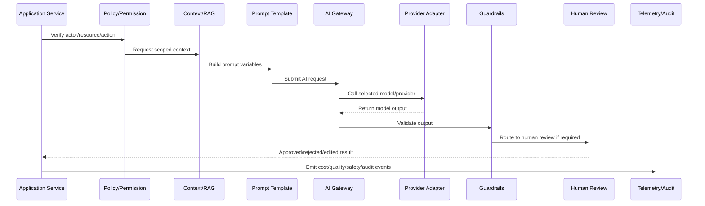

# AI and Automation Testing Readiness

> *"Defines testing standards for prompts, provider adapters, RAG, guardrails, human review, automation workflows, cost controls, failure modes, and production readiness."*

---

# Purpose

Defines testing standards for prompts, provider adapters, RAG, guardrails, human review, automation workflows, cost controls, failure modes, and production readiness.

---

# AI/Automation Problem

AI workflows that pass only manual demos can fail badly under real user data, adversarial input, or provider outages.

---

# AI/Automation Decision

## Decision

CLARA AI and automation implementation should pass functional, safety, security, quality, cost, and operational readiness tests before launch.

## Status

Accepted.

---

# AI Gateway Implementation Rule

Every CLARA AI or automation capability should be implemented as:

```text
Use Case -> Policy Check -> Context Assembly -> Prompt Template -> AI Gateway -> Provider Adapter -> Guardrails -> Review/Approval -> Action/Response -> Telemetry -> Audit -> Tests
```

An AI/automation change is not production-ready if it cannot answer:

```text
what user/business workflow it supports
what model/provider it uses
what prompt/template version it uses
what context it can access
how tenant/workspace scope is enforced
what safety checks run before and after the model call
whether human review is required
what action can be taken automatically
how cost is tracked
how output quality is evaluated
how the feature can be disabled
what tests prove safe behavior
```

---

# Recommended AI Workflow



---

# Production-Ready Checklist

- [ ] AI call goes through AI Gateway.
- [ ] Provider adapter is isolated.
- [ ] Prompt template is versioned.
- [ ] Context is tenant/workspace scoped.
- [ ] Prompt injection risk is reviewed.
- [ ] Sensitive data exposure is minimized.
- [ ] Output guardrails exist.
- [ ] Human review exists where needed.
- [ ] Cost/token tracking exists.
- [ ] Fallback/kill switch exists.
- [ ] Tests cover failure and abuse cases.
- [ ] Runbook/operational notes exist.

---

# Acceptance Criteria

- [ ] AI workflow boundary is explicit.
- [ ] Safety controls are implemented.
- [ ] Cost and quality can be measured.
- [ ] Human review and approval are supported.
- [ ] Automation is idempotent and auditable.
- [ ] Failure modes degrade safely.
- [ ] AI coding assistants can apply this safely.

---

# Anti-patterns

Avoid:

- Calling AI providers directly from random modules.
- Hard-coding prompts in controllers.
- Sending unscoped customer data to AI.
- Trusting model output without validation.
- Letting AI execute high-impact actions without approval.
- Logging raw prompts/responses containing sensitive data.
- No model/provider timeout.
- No cost tracking.
- No kill switch.
- No prompt/version history.
- No adversarial/prompt injection tests.

---

# Related Documents

- ../PART-03-Backend-Implementation/README.md
- ../PART-05-Database-and-Migration-Implementation/README.md
- ../../BOOK-06-Security-Governance-and-Compliance/BOOK-06-Master-Index/README.md
- ../../BOOK-07-Operations-Observability-and-Reliability/PART-02-Observability-Strategy/README.md
- ../../BOOK-07-Operations-Observability-and-Reliability/PART-05-Reliability-Engineering/README.md

---

# Navigation

**Previous:** `70-AI-Fallback-Kill-Switch-and-Degraded-Mode.md`

**Next:** `72-Part-06-Summary.md`

---

# AI Test Types

Implement:

```text
prompt unit tests
prompt regression tests
provider adapter tests
schema/output validation tests
RAG permission tests
prompt injection tests
sensitive data leakage tests
human review workflow tests
cost guard tests
fallback/kill switch tests
automation idempotency tests
load/latency smoke tests
```

---

# Safety Test Cases

Test:

```text
malicious user asks model to ignore instructions
retrieved context contains hostile instructions
wrong workspace context is requested
model returns invalid JSON/action
model includes sensitive data
provider times out
cost limit exceeded
human reviewer rejects output
automation retries same event twice
kill switch is enabled
```

---

# AI Readiness Checklist

- [ ] AI Gateway path is used.
- [ ] Provider adapters are tested.
- [ ] Prompts are versioned and reviewed.
- [ ] RAG is permission-scoped.
- [ ] Guardrails run before/after model call.
- [ ] Human review exists where required.
- [ ] Cost/token tracking exists.
- [ ] Fallback/kill switch works.
- [ ] Automation is idempotent.
- [ ] Audit events are emitted.
- [ ] Security/prompt injection tests pass.
- [ ] Runbooks exist.
