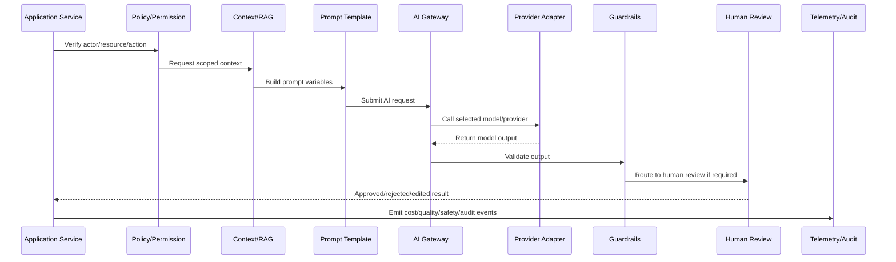

# Part 06 Summary

> *"Summarizes AI Gateway and Automation Implementation and prepares for Book VIII Part 07."*

---

# Purpose

Summarizes AI Gateway and Automation Implementation and prepares for Book VIII Part 07.

---

# AI/Automation Problem

Integration and Webhook Implementation comes next because AI and automation often depend on external channels, webhooks, providers, and event-driven ingestion.

---

# AI/Automation Decision

## Decision

CLARA should proceed to Integration and Webhook Implementation after defining AI Gateway bootstrap, provider adapters, prompts, RAG, guardrails, review workflows, observability, automation, fallback behavior, and testing readiness.

## Status

Accepted.

---

# AI Gateway Implementation Rule

Every CLARA AI or automation capability should be implemented as:

```text
Use Case -> Policy Check -> Context Assembly -> Prompt Template -> AI Gateway -> Provider Adapter -> Guardrails -> Review/Approval -> Action/Response -> Telemetry -> Audit -> Tests
```

An AI/automation change is not production-ready if it cannot answer:

```text
what user/business workflow it supports
what model/provider it uses
what prompt/template version it uses
what context it can access
how tenant/workspace scope is enforced
what safety checks run before and after the model call
whether human review is required
what action can be taken automatically
how cost is tracked
how output quality is evaluated
how the feature can be disabled
what tests prove safe behavior
```

---

# Recommended AI Workflow



---

# Production-Ready Checklist

- [ ] AI call goes through AI Gateway.
- [ ] Provider adapter is isolated.
- [ ] Prompt template is versioned.
- [ ] Context is tenant/workspace scoped.
- [ ] Prompt injection risk is reviewed.
- [ ] Sensitive data exposure is minimized.
- [ ] Output guardrails exist.
- [ ] Human review exists where needed.
- [ ] Cost/token tracking exists.
- [ ] Fallback/kill switch exists.
- [ ] Tests cover failure and abuse cases.
- [ ] Runbook/operational notes exist.

---

# Acceptance Criteria

- [ ] AI workflow boundary is explicit.
- [ ] Safety controls are implemented.
- [ ] Cost and quality can be measured.
- [ ] Human review and approval are supported.
- [ ] Automation is idempotent and auditable.
- [ ] Failure modes degrade safely.
- [ ] AI coding assistants can apply this safely.

---

# Anti-patterns

Avoid:

- Calling AI providers directly from random modules.
- Hard-coding prompts in controllers.
- Sending unscoped customer data to AI.
- Trusting model output without validation.
- Letting AI execute high-impact actions without approval.
- Logging raw prompts/responses containing sensitive data.
- No model/provider timeout.
- No cost tracking.
- No kill switch.
- No prompt/version history.
- No adversarial/prompt injection tests.

---

# Related Documents

- ../PART-03-Backend-Implementation/README.md
- ../PART-05-Database-and-Migration-Implementation/README.md
- ../../BOOK-06-Security-Governance-and-Compliance/BOOK-06-Master-Index/README.md
- ../../BOOK-07-Operations-Observability-and-Reliability/PART-02-Observability-Strategy/README.md
- ../../BOOK-07-Operations-Observability-and-Reliability/PART-05-Reliability-Engineering/README.md

---

# Navigation

**Previous:** `71-AI-and-Automation-Testing-Readiness.md`

**Next:** `../PART-07-Integration-and-Webhook-Implementation/README.md`

---

# Part 06 Completion

Part 06 establishes:

- AI Gateway and automation implementation overview.
- AI Gateway service bootstrap.
- Provider adapter implementation.
- Prompt and template implementation.
- Context and RAG implementation.
- AI safety and guardrail implementation.
- Human review and approval workflow implementation.
- AI observability, cost, and quality tracking.
- Automation workflow implementation.
- AI fallback, kill switch, and degraded mode.
- AI and automation testing readiness.

---

# Ready for Part 07

The next part should be:

```text
BOOK VIII — PART 07: Integration and Webhook Implementation
```

It should define:

- Integration implementation overview.
- Channel/provider adapter standards.
- Webhook ingestion implementation.
- Signature verification.
- Idempotency and replay protection.
- Event normalization.
- External API rate limits and retries.
- Dead-letter handling.
- Integration observability.
- Integration security.
- Integration testing and readiness.
