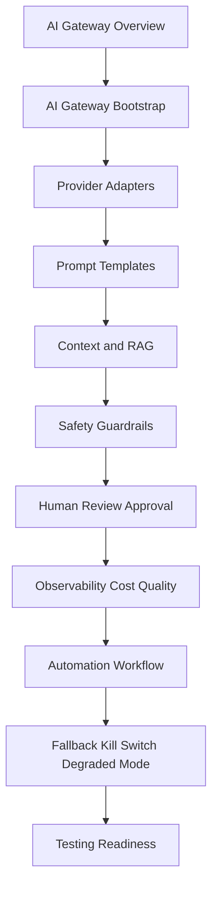

# PART-06 — AI Gateway and Automation Implementation

> *"AI in production is not just a model call. It is policy, context, safety, review, observability, cost control, and graceful failure."*

---

# Purpose

Part 06 defines CLARA's AI Gateway and automation implementation standards.

It covers:

- AI Gateway and Automation Implementation overview.
- AI Gateway Service Bootstrap.
- Provider Adapter Implementation.
- Prompt and Template Implementation.
- Context and RAG Implementation.
- AI Safety and Guardrail Implementation.
- Human Review and Approval Workflow Implementation.
- AI Observability, Cost, and Quality Tracking.
- Automation Workflow Implementation.
- AI Fallback, Kill Switch, and Degraded Mode.
- AI and Automation Testing Readiness.
- Part 06 Summary.

---

# Chapter Map

| Chapter | Title |
|---:|---|
| 61 | AI Gateway and Automation Implementation Overview |
| 62 | AI Gateway Service Bootstrap |
| 63 | Provider Adapter Implementation |
| 64 | Prompt and Template Implementation |
| 65 | Context and RAG Implementation |
| 66 | AI Safety and Guardrail Implementation |
| 67 | Human Review and Approval Workflow Implementation |
| 68 | AI Observability Cost and Quality Tracking |
| 69 | Automation Workflow Implementation |
| 70 | AI Fallback Kill Switch and Degraded Mode |
| 71 | AI and Automation Testing Readiness |
| 72 | Part 06 Summary |

---

# AI Gateway Implementation Map



---

# AI and Automation Non-Negotiables

CLARA AI and automation implementation must enforce:

```text
central AI Gateway
provider isolation
validated prompts/templates
tenant/workspace-scoped context
prompt injection defense
input/output guardrails
human review for high-impact actions
cost and token tracking
privacy-safe telemetry
automation idempotency
audit events for sensitive actions
fallback and kill switch support
safe degraded mode
AI quality testing
security testing
operational runbooks
```

---

# Relationship to Previous Parts

Part 03 defines backend implementation.

Part 05 defines database and migration implementation.

Part 06 defines how AI and automation are safely implemented on top of backend, data, security, and operations foundations.

---

# Navigation

**Previous:** `../PART-05-Database-and-Migration-Implementation/60-Database-Testing-and-Readiness-Checklist.md`

**Next:** `61-AI-Gateway-and-Automation-Implementation-Overview.md`
