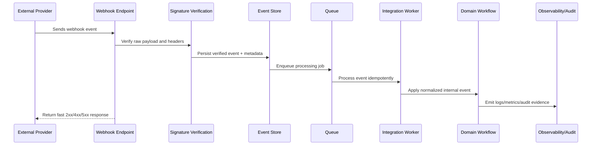

# Integration Testing and Sandbox Strategy

> *"Defines integration testing strategy for provider sandboxes, contract tests, webhook fixtures, signature tests, replay tests, failure simulations, and local mocks."*

---

# Purpose

Defines integration testing strategy for provider sandboxes, contract tests, webhook fixtures, signature tests, replay tests, failure simulations, and local mocks.

---

# Integration Problem

Integrations that only pass happy-path manual tests often fail with real provider edge cases.

---

# Integration Decision

## Decision

CLARA integrations should be tested with deterministic fixtures, provider sandbox environments, security cases, and failure scenarios before production activation.

## Status

Accepted.

---

# Integration Implementation Rule

Every CLARA integration should be implemented as:

```text
Provider Adapter -> Inbound/Outbound Contract -> Authentication/Signature Verification -> Event Persistence -> Idempotency -> Normalization -> Queue/Worker -> Business Workflow -> Observability -> Audit -> Tests
```

An integration change is not production-ready if it cannot answer:

```text
what provider/channel it connects to
what credentials/scopes it needs
how inbound events are verified
how duplicate events are handled
how replay is prevented
what internal event contract is produced
how tenant/workspace scope is enforced
how provider failures are retried or degraded
how failed events are reprocessed
what telemetry supports operations
what tests prove safe behavior
```

---

# Recommended Integration Flow



---

# Production-Ready Checklist

- [ ] Provider adapter contract exists.
- [ ] Webhook raw body is preserved where required.
- [ ] Signature verification is implemented.
- [ ] Timestamp/replay protection exists.
- [ ] Events are persisted before processing.
- [ ] Processing is idempotent.
- [ ] Internal event schema is versioned.
- [ ] Retry policy is bounded.
- [ ] Dead-letter handling exists.
- [ ] Reprocessing is safe.
- [ ] Observability dashboard exists.
- [ ] Credentials and payloads are protected.
- [ ] Tests cover provider failures and malicious inputs.

---

# Acceptance Criteria

- [ ] External input is treated as untrusted.
- [ ] Integration provider details are isolated.
- [ ] Duplicate and replay risks are controlled.
- [ ] Business logic consumes internal contracts.
- [ ] Failures are observable and recoverable.
- [ ] Security and privacy boundaries are clear.
- [ ] AI coding assistants can apply this safely.

---

# Anti-patterns

Avoid:

- Processing webhook business logic synchronously in the HTTP handler.
- Skipping signature verification in production.
- Trusting provider payloads without validation.
- Using provider event ID without checking scope/source.
- No idempotency key.
- Infinite retries.
- Dead-letter events with no owner.
- Reprocessing without duplicate side-effect protection.
- Logging full payloads with sensitive data.
- Scattered provider-specific code across domain services.

---

# Related Documents

- ../PART-03-Backend-Implementation/README.md
- ../PART-05-Database-and-Migration-Implementation/README.md
- ../PART-06-AI-Gateway-and-Automation-Implementation/README.md
- ../../BOOK-06-Security-Governance-and-Compliance/BOOK-06-Master-Index/README.md
- ../../BOOK-07-Operations-Observability-and-Reliability/PART-03-Logging-and-Metrics/README.md
- ../../BOOK-07-Operations-Observability-and-Reliability/PART-09-Runbooks-and-Playbooks/README.md

---

# Navigation

**Previous:** `82-Integration-Security-and-Privacy-Baseline.md`

**Next:** `84-Part-07-Summary.md`

---

# Integration Test Types

Implement:

```text
adapter unit tests
provider contract tests
webhook signature tests
webhook fixture tests
idempotency tests
replay protection tests
normalization tests
rate limit/retry tests
dead-letter tests
security tests
sandbox e2e tests
```

---

# Fixture Strategy

Store safe fixtures:

```text
tests/fixtures/webhooks/<provider>/<event-type>.json
tests/fixtures/webhooks/<provider>/headers.json
tests/fixtures/webhooks/<provider>/invalid-signature.json
```

Fixtures must not contain real secrets or customer data.

---

# Sandbox Strategy

Use provider sandboxes for:

```text
auth flow testing
webhook delivery testing
message send/receive testing
rate limit behavior where possible
attachment flow testing
provider error mapping
```

---

# Testing Rule

Every integration should test valid event, invalid signature, duplicate event, stale replay, provider timeout, and malformed payload.
