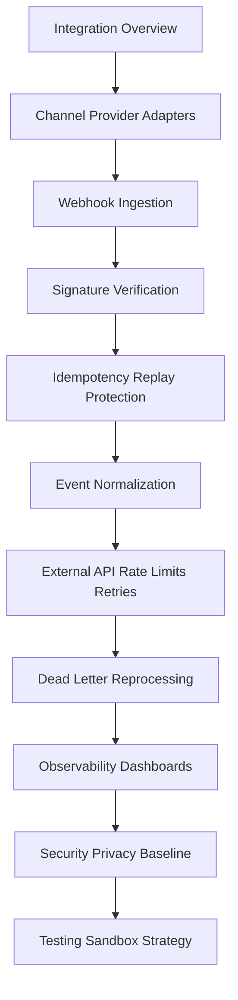

# PART-07 — Integration and Webhook Implementation

> *"Every integration is a trust boundary. Every webhook is external input entering production."*

---

# Purpose

Part 07 defines CLARA's integration and webhook implementation standards.

It covers:

- Integration and Webhook Implementation overview.
- Channel and Provider Adapter Standards.
- Webhook Ingestion Implementation.
- Webhook Signature Verification.
- Idempotency and Replay Protection.
- Event Normalization and Internal Contracts.
- External API Rate Limits and Retry Policy.
- Dead Letter and Reprocessing Implementation.
- Integration Observability and Operational Dashboards.
- Integration Security and Privacy Baseline.
- Integration Testing and Sandbox Strategy.
- Part 07 Summary.

---

# Chapter Map

| Chapter | Title |
|---:|---|
| 73 | Integration and Webhook Implementation Overview |
| 74 | Channel and Provider Adapter Standards |
| 75 | Webhook Ingestion Implementation |
| 76 | Webhook Signature Verification |
| 77 | Idempotency and Replay Protection |
| 78 | Event Normalization and Internal Contracts |
| 79 | External API Rate Limits and Retry Policy |
| 80 | Dead Letter and Reprocessing Implementation |
| 81 | Integration Observability and Operational Dashboards |
| 82 | Integration Security and Privacy Baseline |
| 83 | Integration Testing and Sandbox Strategy |
| 84 | Part 07 Summary |

---

# Integration Implementation Map



---

# Integration Non-Negotiables

CLARA integration implementation must enforce:

```text
provider adapter isolation
webhook raw body preservation
signature verification
timestamp/replay protection
idempotent event processing
event normalization
versioned internal contracts
bounded external API retries
provider rate limit handling
dead-letter capture
safe reprocessing
privacy-safe observability
credential protection
tenant/workspace scoping
sandbox and fixture testing
```

---

# Relationship to Previous Parts

Part 06 defines AI Gateway and Automation Implementation.

Part 07 defines external provider/channel integration and webhook implementation, which often feeds automation, AI workflows, inbox ingestion, CRM sync, and support operations.

---

# Navigation

**Previous:** `../PART-06-AI-Gateway-and-Automation-Implementation/72-Part-06-Summary.md`

**Next:** `73-Integration-and-Webhook-Implementation-Overview.md`
