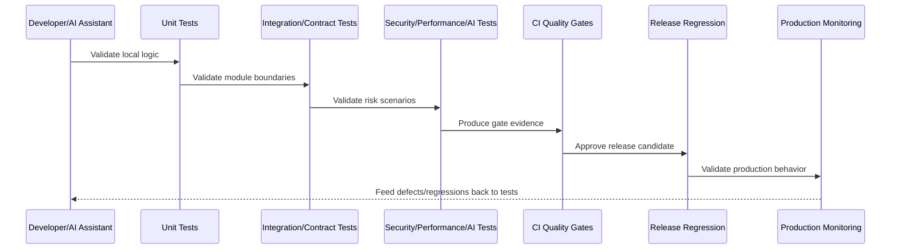
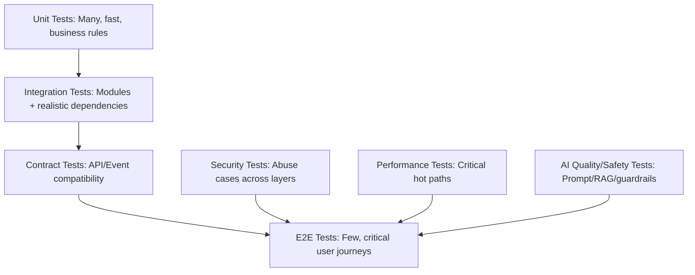

# Testing and Quality Implementation Overview

> *"Introduces CLARA's testing and quality implementation model for proving correctness, security, reliability, performance, and production readiness across the whole system."*

---

# Purpose

Introduces CLARA's testing and quality implementation model for proving correctness, security, reliability, performance, and production readiness across the whole system.

---

# Quality Problem

Testing becomes weak when it is treated as an afterthought instead of an engineering system that protects production.

---

# Quality Decision

## Decision

CLARA should implement testing as a layered quality system that covers unit, integration, contract, e2e, security, performance, AI quality, fixtures, CI gates, and release regression.

## Status

Accepted.

---

# Testing Implementation Rule

Every CLARA production feature should be protected by the smallest useful set of tests across:

```text
unit
integration
contract
end-to-end
security
performance
AI quality/safety where applicable
release regression
```

A feature is not production-ready if it cannot answer:

```text
what critical behavior is tested
what failure cases are tested
what authorization cases are tested
what tenant/workspace isolation cases are tested
what contract is protected
what performance expectation exists
what security abuse case is covered
what test data is used
what CI gate blocks unsafe changes
```

---

# Recommended Quality Flow



---

# Production-Ready Checklist

- [ ] Critical business rules are tested.
- [ ] Important failure paths are tested.
- [ ] Authorization is tested.
- [ ] Tenant/workspace isolation is tested.
- [ ] Contracts are tested.
- [ ] Security abuse cases are tested.
- [ ] Performance risks are considered.
- [ ] AI safety/quality is tested where relevant.
- [ ] Test data is safe and deterministic.
- [ ] CI gate blocks unsafe changes.
- [ ] Release regression is defined.

---

# Acceptance Criteria

- [ ] Quality strategy is layered.
- [ ] Tests map to production risks.
- [ ] CI gates are actionable.
- [ ] Security and reliability are included.
- [ ] Test data is safe.
- [ ] Release readiness is measurable.
- [ ] AI coding assistants can apply this safely.

---

# Anti-patterns

Avoid:

- Only testing happy paths.
- Tests that require real production credentials.
- Tests that depend on execution order without reason.
- Snapshot-only frontend testing.
- Contract changes without contract tests.
- Authorization tests only for admin users.
- Performance assumptions from tiny seed data.
- AI prompt demos without adversarial tests.
- Non-blocking CI gates for critical failures.
- Using real customer data in test fixtures.

---

# Related Documents

- ../PART-03-Backend-Implementation/README.md
- ../PART-04-Frontend-and-Client-Implementation/README.md
- ../PART-05-Database-and-Migration-Implementation/README.md
- ../PART-06-AI-Gateway-and-Automation-Implementation/README.md
- ../PART-07-Integration-and-Webhook-Implementation/README.md
- ../../BOOK-06-Security-Governance-and-Compliance/BOOK-06-Master-Index/README.md
- ../../BOOK-07-Operations-Observability-and-Reliability/BOOK-07-Master-Index/README.md

---

# Navigation

**Previous:** `../PART-07-Integration-and-Webhook-Implementation/84-Part-07-Summary.md`

**Next:** `86-Unit-Testing-Implementation.md`

---

# Quality Scope

CLARA quality implementation covers:

```text
backend logic
frontend workflows
database migrations
repository queries
AI prompts and guardrails
automation workflows
integration adapters
webhook ingestion
security boundaries
performance budgets
release regression
```

---

# Testing Pyramid for CLARA



---

# Quality Principle

A test should either protect customer value, security, reliability, maintainability, or release confidence.
