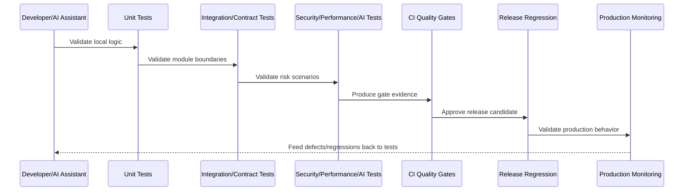

# Contract Testing Implementation

> *"Defines contract testing standards for API DTOs, event schemas, webhook payloads, provider adapters, internal package contracts, and backward compatibility."*

---

# Purpose

Defines contract testing standards for API DTOs, event schemas, webhook payloads, provider adapters, internal package contracts, and backward compatibility.

---

# Quality Problem

Contract drift causes runtime failures when independently changed modules disagree about request, response, or event shapes.

---

# Quality Decision

## Decision

CLARA contract tests should prevent backend/frontend, service/worker, and provider/domain contract drift.

## Status

Accepted.

---

# Testing Implementation Rule

Every CLARA production feature should be protected by the smallest useful set of tests across:

```text
unit
integration
contract
end-to-end
security
performance
AI quality/safety where applicable
release regression
```

A feature is not production-ready if it cannot answer:

```text
what critical behavior is tested
what failure cases are tested
what authorization cases are tested
what tenant/workspace isolation cases are tested
what contract is protected
what performance expectation exists
what security abuse case is covered
what test data is used
what CI gate blocks unsafe changes
```

---

# Recommended Quality Flow



---

# Production-Ready Checklist

- [ ] Critical business rules are tested.
- [ ] Important failure paths are tested.
- [ ] Authorization is tested.
- [ ] Tenant/workspace isolation is tested.
- [ ] Contracts are tested.
- [ ] Security abuse cases are tested.
- [ ] Performance risks are considered.
- [ ] AI safety/quality is tested where relevant.
- [ ] Test data is safe and deterministic.
- [ ] CI gate blocks unsafe changes.
- [ ] Release regression is defined.

---

# Acceptance Criteria

- [ ] Quality strategy is layered.
- [ ] Tests map to production risks.
- [ ] CI gates are actionable.
- [ ] Security and reliability are included.
- [ ] Test data is safe.
- [ ] Release readiness is measurable.
- [ ] AI coding assistants can apply this safely.

---

# Anti-patterns

Avoid:

- Only testing happy paths.
- Tests that require real production credentials.
- Tests that depend on execution order without reason.
- Snapshot-only frontend testing.
- Contract changes without contract tests.
- Authorization tests only for admin users.
- Performance assumptions from tiny seed data.
- AI prompt demos without adversarial tests.
- Non-blocking CI gates for critical failures.
- Using real customer data in test fixtures.

---

# Related Documents

- ../PART-03-Backend-Implementation/README.md
- ../PART-04-Frontend-and-Client-Implementation/README.md
- ../PART-05-Database-and-Migration-Implementation/README.md
- ../PART-06-AI-Gateway-and-Automation-Implementation/README.md
- ../PART-07-Integration-and-Webhook-Implementation/README.md
- ../../BOOK-06-Security-Governance-and-Compliance/BOOK-06-Master-Index/README.md
- ../../BOOK-07-Operations-Observability-and-Reliability/BOOK-07-Master-Index/README.md

---

# Navigation

**Previous:** `87-Integration-Testing-Implementation.md`

**Next:** `89-End-to-End-Testing-Implementation.md`

---

# Contract Test Targets

Protect contracts between:

```text
backend API and frontend client
service and worker events
integration adapter and internal event schema
AI Gateway request/response schema
webhook normalized event and domain workflow
shared packages and consumers
```

---

# Contract Artifacts

Contract tests should validate:

```text
request DTOs
response DTOs
event schemas
error response shape
pagination shape
webhook normalized schema
AI Gateway internal contract
```

---

# Compatibility Rules

When contracts change:

```text
version if breaking
support compatibility window where needed
update consumers
update fixtures
update docs
run contract tests in CI
```

---

# Contract Rule

Any boundary used by more than one module should have a testable contract.
