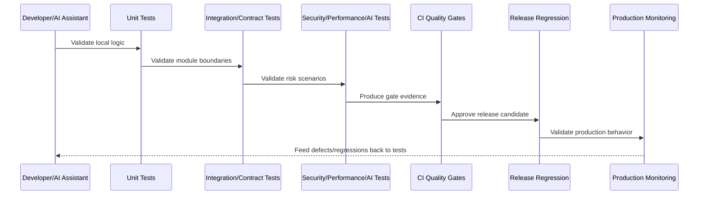

# Part 08 Summary

> *"Summarizes Testing and Quality Implementation and prepares for Book VIII Part 09."*

---

# Purpose

Summarizes Testing and Quality Implementation and prepares for Book VIII Part 09.

---

# Quality Problem

CI/CD and Environment Implementation comes next because quality gates must be wired into real pipelines and deployment environments.

---

# Quality Decision

## Decision

CLARA should proceed to CI/CD and Environment Implementation after defining unit, integration, contract, e2e, security, performance, AI, test data, CI quality gates, and release regression strategy.

## Status

Accepted.

---

# Testing Implementation Rule

Every CLARA production feature should be protected by the smallest useful set of tests across:

```text
unit
integration
contract
end-to-end
security
performance
AI quality/safety where applicable
release regression
```

A feature is not production-ready if it cannot answer:

```text
what critical behavior is tested
what failure cases are tested
what authorization cases are tested
what tenant/workspace isolation cases are tested
what contract is protected
what performance expectation exists
what security abuse case is covered
what test data is used
what CI gate blocks unsafe changes
```

---

# Recommended Quality Flow



---

# Production-Ready Checklist

- [ ] Critical business rules are tested.
- [ ] Important failure paths are tested.
- [ ] Authorization is tested.
- [ ] Tenant/workspace isolation is tested.
- [ ] Contracts are tested.
- [ ] Security abuse cases are tested.
- [ ] Performance risks are considered.
- [ ] AI safety/quality is tested where relevant.
- [ ] Test data is safe and deterministic.
- [ ] CI gate blocks unsafe changes.
- [ ] Release regression is defined.

---

# Acceptance Criteria

- [ ] Quality strategy is layered.
- [ ] Tests map to production risks.
- [ ] CI gates are actionable.
- [ ] Security and reliability are included.
- [ ] Test data is safe.
- [ ] Release readiness is measurable.
- [ ] AI coding assistants can apply this safely.

---

# Anti-patterns

Avoid:

- Only testing happy paths.
- Tests that require real production credentials.
- Tests that depend on execution order without reason.
- Snapshot-only frontend testing.
- Contract changes without contract tests.
- Authorization tests only for admin users.
- Performance assumptions from tiny seed data.
- AI prompt demos without adversarial tests.
- Non-blocking CI gates for critical failures.
- Using real customer data in test fixtures.

---

# Related Documents

- ../PART-03-Backend-Implementation/README.md
- ../PART-04-Frontend-and-Client-Implementation/README.md
- ../PART-05-Database-and-Migration-Implementation/README.md
- ../PART-06-AI-Gateway-and-Automation-Implementation/README.md
- ../PART-07-Integration-and-Webhook-Implementation/README.md
- ../../BOOK-06-Security-Governance-and-Compliance/BOOK-06-Master-Index/README.md
- ../../BOOK-07-Operations-Observability-and-Reliability/BOOK-07-Master-Index/README.md

---

# Navigation

**Previous:** `95-Release-Quality-and-Regression-Strategy.md`

**Next:** `../PART-09-CI-CD-and-Environment-Implementation/README.md`

---

# Part 08 Completion

Part 08 establishes:

- Testing and quality implementation overview.
- Unit testing implementation.
- Integration testing implementation.
- Contract testing implementation.
- End-to-end testing implementation.
- Security testing implementation.
- Performance and load testing implementation.
- AI quality and safety testing implementation.
- Test data, fixture, and mock strategy.
- CI quality gates and coverage policy.
- Release quality and regression strategy.

---

# Ready for Part 09

The next part should be:

```text
BOOK VIII — PART 09: CI/CD and Environment Implementation
```

It should define:

- CI/CD implementation overview.
- Branching and merge strategy.
- Pipeline structure.
- Build and artifact strategy.
- Environment promotion.
- Secret and config injection.
- Migration deployment workflow.
- Feature flag rollout.
- Deployment strategies.
- Rollback and hotfix workflow.
- Pipeline security and evidence.
