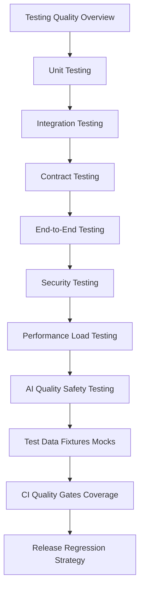

# PART-08 — Testing and Quality Implementation

> *"Testing is not proof that nothing can fail. Testing is evidence that the most important failures have been considered."*

---

# Purpose

Part 08 defines CLARA's testing and quality implementation standards.

It covers:

- Testing and Quality Implementation overview.
- Unit Testing Implementation.
- Integration Testing Implementation.
- Contract Testing Implementation.
- End-to-End Testing Implementation.
- Security Testing Implementation.
- Performance and Load Testing Implementation.
- AI Quality and Safety Testing Implementation.
- Test Data, Fixture, and Mock Strategy.
- CI Quality Gates and Coverage Policy.
- Release Quality and Regression Strategy.
- Part 08 Summary.

---

# Chapter Map

| Chapter | Title |
|---:|---|
| 85 | Testing and Quality Implementation Overview |
| 86 | Unit Testing Implementation |
| 87 | Integration Testing Implementation |
| 88 | Contract Testing Implementation |
| 89 | End-to-End Testing Implementation |
| 90 | Security Testing Implementation |
| 91 | Performance and Load Testing Implementation |
| 92 | AI Quality and Safety Testing Implementation |
| 93 | Test Data Fixture and Mock Strategy |
| 94 | CI Quality Gates and Coverage Policy |
| 95 | Release Quality and Regression Strategy |
| 96 | Part 08 Summary |

---

# Testing Implementation Map



---

# Quality Non-Negotiables

CLARA testing implementation must enforce:

```text
business rule unit tests
authorization policy tests
tenant/workspace isolation tests
database migration tests
API contract tests
frontend critical workflow tests
integration/webhook tests
AI safety and quality tests
security abuse-case tests
performance budget checks
safe test data
CI blocking gates
release regression checklist
post-release monitoring
```

---

# Relationship to Previous Parts

Parts 03–07 define backend, frontend, database, AI, automation, and integration implementation.

Part 08 defines the quality system that protects those implementations before production launch.

---

# Navigation

**Previous:** `../PART-07-Integration-and-Webhook-Implementation/84-Part-07-Summary.md`

**Next:** `85-Testing-and-Quality-Implementation-Overview.md`
