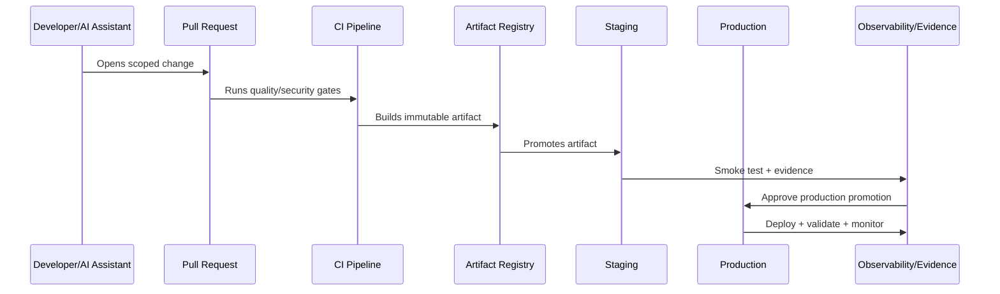

# Secret and Configuration Injection

> *"Defines secure injection of environment variables, secrets, runtime config, feature flags, and deployment-time configuration validation."*

---

# Purpose

Defines secure injection of environment variables, secrets, runtime config, feature flags, and deployment-time configuration validation.

---

# Delivery Problem

CI/CD often becomes a secret leakage path when variables, logs, and deployment scripts are not controlled.

---

# Delivery Decision

## Decision

CLARA should inject secrets from approved secret sources, validate configuration at startup, and avoid committing or exposing sensitive values in CI/CD logs.

## Status

Accepted.

---

# CI/CD Implementation Rule

Every CLARA production change should move through:

```text
Commit -> Pull Request -> Review -> CI Quality Gates -> Build Artifact -> Environment Promotion -> Deployment -> Smoke Validation -> Observability Check -> Evidence Capture
```

A delivery workflow is not production-ready if it cannot answer:

```text
who approved the change
what tests and scans passed
what artifact was built
what environment received it
what config/secrets were used
what migration ran
what feature flags changed
how deployment was validated
how rollback/forward-fix works
where audit evidence is stored
```

---

# Recommended Delivery Flow



---

# Production-Ready Checklist

- [ ] Branch protection exists.
- [ ] Required reviews exist.
- [ ] Quality gates block unsafe changes.
- [ ] Security scans run.
- [ ] Artifact is immutable and traceable.
- [ ] Environment promotion is explicit.
- [ ] Secrets are injected securely.
- [ ] Migrations are controlled.
- [ ] Feature flags are documented.
- [ ] Deployment strategy is selected.
- [ ] Rollback/hotfix path exists.
- [ ] Evidence is captured.

---

# Acceptance Criteria

- [ ] Delivery path is repeatable.
- [ ] Production changes are traceable.
- [ ] Pipeline blocks risky changes.
- [ ] Secrets are protected.
- [ ] Deployment and rollback are clear.
- [ ] Audit evidence is available.
- [ ] AI coding assistants can apply this safely.

---

# Anti-patterns

Avoid:

- Direct commits to protected branches.
- Manual production deploys with no evidence.
- Rebuilding artifacts separately per environment.
- CI logs that expose secrets.
- Migration execution without review.
- Feature flags with no owner or cleanup date.
- Rollbacks that do not consider database compatibility.
- Long-lived release branches with unmerged fixes.
- Pipeline credentials with broad production access.
- Non-blocking critical security gates.

---

# Related Documents

- ../PART-08-Testing-and-Quality-Implementation/README.md
- ../PART-05-Database-and-Migration-Implementation/README.md
- ../PART-06-AI-Gateway-and-Automation-Implementation/README.md
- ../../BOOK-06-Security-Governance-and-Compliance/BOOK-06-Master-Index/README.md
- ../../BOOK-07-Operations-Observability-and-Reliability/BOOK-07-Master-Index/README.md

---

# Navigation

**Previous:** `101-Environment-Promotion-Workflow.md`

**Next:** `103-Migration-Deployment-Workflow.md`

---

# Secret Injection Rules

Secrets should come from:

```text
secret manager
CI/CD protected secrets
environment-specific secure config store
runtime platform secret injection
```

Secrets should not be:

```text
committed to repo
printed in logs
stored in artifacts
embedded in frontend bundles
shared in chat/tickets/docs
copied from production to local
```

---

# Configuration Validation

Validate at startup:

```text
required config exists
config type/format is valid
production unsafe defaults are rejected
feature flag config is readable
provider credentials are present only where needed
```

---

# Public vs Secret Config

Public frontend config may include:

```text
public API URL
environment name
app version
public telemetry key if safe
```

Secret config includes:

```text
database URL
API secrets
provider tokens
private keys
signing secrets
webhook secrets
```

---

# Config Rule

A missing or unsafe production config should fail closed, not silently use development defaults.
