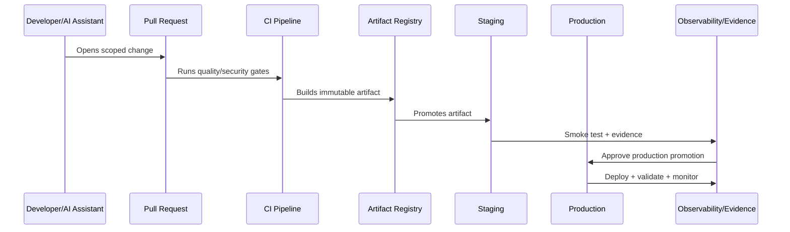

# Deployment Strategies

> *"Defines deployment strategies including rolling, blue-green, canary, shadow, preview environments, worker deployment, and integration rollout considerations."*

---

# Purpose

Defines deployment strategies including rolling, blue-green, canary, shadow, preview environments, worker deployment, and integration rollout considerations.

---

# Delivery Problem

One deployment strategy does not fit all services, especially when workers, migrations, and integrations are involved.

---

# Delivery Decision

## Decision

CLARA should choose deployment strategies based on risk, reversibility, migration compatibility, traffic pattern, and operational readiness.

## Status

Accepted.

---

# CI/CD Implementation Rule

Every CLARA production change should move through:

```text
Commit -> Pull Request -> Review -> CI Quality Gates -> Build Artifact -> Environment Promotion -> Deployment -> Smoke Validation -> Observability Check -> Evidence Capture
```

A delivery workflow is not production-ready if it cannot answer:

```text
who approved the change
what tests and scans passed
what artifact was built
what environment received it
what config/secrets were used
what migration ran
what feature flags changed
how deployment was validated
how rollback/forward-fix works
where audit evidence is stored
```

---

# Recommended Delivery Flow



---

# Production-Ready Checklist

- [ ] Branch protection exists.
- [ ] Required reviews exist.
- [ ] Quality gates block unsafe changes.
- [ ] Security scans run.
- [ ] Artifact is immutable and traceable.
- [ ] Environment promotion is explicit.
- [ ] Secrets are injected securely.
- [ ] Migrations are controlled.
- [ ] Feature flags are documented.
- [ ] Deployment strategy is selected.
- [ ] Rollback/hotfix path exists.
- [ ] Evidence is captured.

---

# Acceptance Criteria

- [ ] Delivery path is repeatable.
- [ ] Production changes are traceable.
- [ ] Pipeline blocks risky changes.
- [ ] Secrets are protected.
- [ ] Deployment and rollback are clear.
- [ ] Audit evidence is available.
- [ ] AI coding assistants can apply this safely.

---

# Anti-patterns

Avoid:

- Direct commits to protected branches.
- Manual production deploys with no evidence.
- Rebuilding artifacts separately per environment.
- CI logs that expose secrets.
- Migration execution without review.
- Feature flags with no owner or cleanup date.
- Rollbacks that do not consider database compatibility.
- Long-lived release branches with unmerged fixes.
- Pipeline credentials with broad production access.
- Non-blocking critical security gates.

---

# Related Documents

- ../PART-08-Testing-and-Quality-Implementation/README.md
- ../PART-05-Database-and-Migration-Implementation/README.md
- ../PART-06-AI-Gateway-and-Automation-Implementation/README.md
- ../../BOOK-06-Security-Governance-and-Compliance/BOOK-06-Master-Index/README.md
- ../../BOOK-07-Operations-Observability-and-Reliability/BOOK-07-Master-Index/README.md

---

# Navigation

**Previous:** `104-Feature-Flag-and-Rollout-Implementation.md`

**Next:** `106-Rollback-and-Hotfix-Workflow.md`

---

# Deployment Strategy Options

Use:

```text
rolling deployment
blue-green deployment
canary deployment
shadow deployment
preview environment
manual maintenance deployment
```

---

# Strategy Selection Factors

Choose based on:

```text
service criticality
database migration compatibility
traffic volume
rollback complexity
statefulness
worker/job behavior
integration provider constraints
customer impact risk
```

---

# Worker Deployment Considerations

For workers:

```text
stop old workers gracefully
avoid double-processing
coordinate queue schema changes
drain or pause queues if needed
support idempotency
monitor lag and error rates
```

---

# Deployment Rule

Deployment strategy must match risk, not team convenience only.
