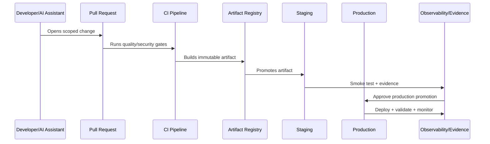

# Part 09 Summary

> *"Summarizes CI/CD and Environment Implementation and prepares for Book VIII Part 10."*

---

# Purpose

Summarizes CI/CD and Environment Implementation and prepares for Book VIII Part 10.

---

# Delivery Problem

Production Launch Plan comes next because the delivery machinery is now ready to support a controlled launch.

---

# Delivery Decision

## Decision

CLARA should proceed to Production Launch Plan after defining branching, pipelines, artifacts, environment promotion, secrets/config, migrations, feature flags, deployments, rollback/hotfix, and pipeline security.

## Status

Accepted.

---

# CI/CD Implementation Rule

Every CLARA production change should move through:

```text
Commit -> Pull Request -> Review -> CI Quality Gates -> Build Artifact -> Environment Promotion -> Deployment -> Smoke Validation -> Observability Check -> Evidence Capture
```

A delivery workflow is not production-ready if it cannot answer:

```text
who approved the change
what tests and scans passed
what artifact was built
what environment received it
what config/secrets were used
what migration ran
what feature flags changed
how deployment was validated
how rollback/forward-fix works
where audit evidence is stored
```

---

# Recommended Delivery Flow



---

# Production-Ready Checklist

- [ ] Branch protection exists.
- [ ] Required reviews exist.
- [ ] Quality gates block unsafe changes.
- [ ] Security scans run.
- [ ] Artifact is immutable and traceable.
- [ ] Environment promotion is explicit.
- [ ] Secrets are injected securely.
- [ ] Migrations are controlled.
- [ ] Feature flags are documented.
- [ ] Deployment strategy is selected.
- [ ] Rollback/hotfix path exists.
- [ ] Evidence is captured.

---

# Acceptance Criteria

- [ ] Delivery path is repeatable.
- [ ] Production changes are traceable.
- [ ] Pipeline blocks risky changes.
- [ ] Secrets are protected.
- [ ] Deployment and rollback are clear.
- [ ] Audit evidence is available.
- [ ] AI coding assistants can apply this safely.

---

# Anti-patterns

Avoid:

- Direct commits to protected branches.
- Manual production deploys with no evidence.
- Rebuilding artifacts separately per environment.
- CI logs that expose secrets.
- Migration execution without review.
- Feature flags with no owner or cleanup date.
- Rollbacks that do not consider database compatibility.
- Long-lived release branches with unmerged fixes.
- Pipeline credentials with broad production access.
- Non-blocking critical security gates.

---

# Related Documents

- ../PART-08-Testing-and-Quality-Implementation/README.md
- ../PART-05-Database-and-Migration-Implementation/README.md
- ../PART-06-AI-Gateway-and-Automation-Implementation/README.md
- ../../BOOK-06-Security-Governance-and-Compliance/BOOK-06-Master-Index/README.md
- ../../BOOK-07-Operations-Observability-and-Reliability/BOOK-07-Master-Index/README.md

---

# Navigation

**Previous:** `107-Pipeline-Security-and-Audit-Evidence.md`

**Next:** `../PART-10-Production-Launch-Plan/README.md`

---

# Part 09 Completion

Part 09 establishes:

- CI/CD and environment implementation overview.
- Branching and merge strategy.
- Pipeline structure and quality gates.
- Build and artifact strategy.
- Environment promotion workflow.
- Secret and configuration injection.
- Migration deployment workflow.
- Feature flag and rollout implementation.
- Deployment strategies.
- Rollback and hotfix workflow.
- Pipeline security and audit evidence.

---

# Ready for Part 10

The next part should be:

```text
BOOK VIII — PART 10: Production Launch Plan
```

It should define:

- Production launch overview.
- Launch readiness criteria.
- Launch scope and release candidate.
- Pre-launch checklist.
- Security and compliance readiness.
- Operations and support readiness.
- Data and migration launch readiness.
- Integration launch readiness.
- AI/automation launch readiness.
- Launch day execution plan.
- Launch communication and post-launch monitoring.
