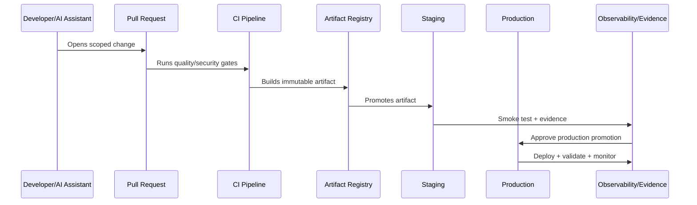

# CI/CD and Environment Implementation Overview

> *"Introduces CLARA's CI/CD and environment implementation model for safely moving code from commit to production with quality gates, environment isolation, deployment control, and audit evidence."*

---

# Purpose

Introduces CLARA's CI/CD and environment implementation model for safely moving code from commit to production with quality gates, environment isolation, deployment control, and audit evidence.

---

# Delivery Problem

A weak CI/CD pipeline turns good engineering standards into optional manual discipline and increases production risk.

---

# Delivery Decision

## Decision

CLARA should implement CI/CD as a secure delivery system that validates code, builds artifacts, promotes through environments, deploys safely, and records evidence.

## Status

Accepted.

---

# CI/CD Implementation Rule

Every CLARA production change should move through:

```text
Commit -> Pull Request -> Review -> CI Quality Gates -> Build Artifact -> Environment Promotion -> Deployment -> Smoke Validation -> Observability Check -> Evidence Capture
```

A delivery workflow is not production-ready if it cannot answer:

```text
who approved the change
what tests and scans passed
what artifact was built
what environment received it
what config/secrets were used
what migration ran
what feature flags changed
how deployment was validated
how rollback/forward-fix works
where audit evidence is stored
```

---

# Recommended Delivery Flow



---

# Production-Ready Checklist

- [ ] Branch protection exists.
- [ ] Required reviews exist.
- [ ] Quality gates block unsafe changes.
- [ ] Security scans run.
- [ ] Artifact is immutable and traceable.
- [ ] Environment promotion is explicit.
- [ ] Secrets are injected securely.
- [ ] Migrations are controlled.
- [ ] Feature flags are documented.
- [ ] Deployment strategy is selected.
- [ ] Rollback/hotfix path exists.
- [ ] Evidence is captured.

---

# Acceptance Criteria

- [ ] Delivery path is repeatable.
- [ ] Production changes are traceable.
- [ ] Pipeline blocks risky changes.
- [ ] Secrets are protected.
- [ ] Deployment and rollback are clear.
- [ ] Audit evidence is available.
- [ ] AI coding assistants can apply this safely.

---

# Anti-patterns

Avoid:

- Direct commits to protected branches.
- Manual production deploys with no evidence.
- Rebuilding artifacts separately per environment.
- CI logs that expose secrets.
- Migration execution without review.
- Feature flags with no owner or cleanup date.
- Rollbacks that do not consider database compatibility.
- Long-lived release branches with unmerged fixes.
- Pipeline credentials with broad production access.
- Non-blocking critical security gates.

---

# Related Documents

- ../PART-08-Testing-and-Quality-Implementation/README.md
- ../PART-05-Database-and-Migration-Implementation/README.md
- ../PART-06-AI-Gateway-and-Automation-Implementation/README.md
- ../../BOOK-06-Security-Governance-and-Compliance/BOOK-06-Master-Index/README.md
- ../../BOOK-07-Operations-Observability-and-Reliability/BOOK-07-Master-Index/README.md

---

# Navigation

**Previous:** `../PART-08-Testing-and-Quality-Implementation/96-Part-08-Summary.md`

**Next:** `98-Branching-and-Merge-Strategy.md`

---

# CI/CD Scope

CLARA CI/CD covers:

```text
pull request validation
quality gates
security scans
builds
artifacts/images
environment promotion
database migrations
feature flag rollout
deployment
rollback/hotfix
audit evidence
```

---

# Environment Scope

Recommended environments:

```text
local
test/CI
development
staging
production
preview environments where useful
sandbox/demo where needed
```

---

# Guiding Question

```text
Can this change be traced, validated, deployed, monitored, and safely reversed or fixed?
```
