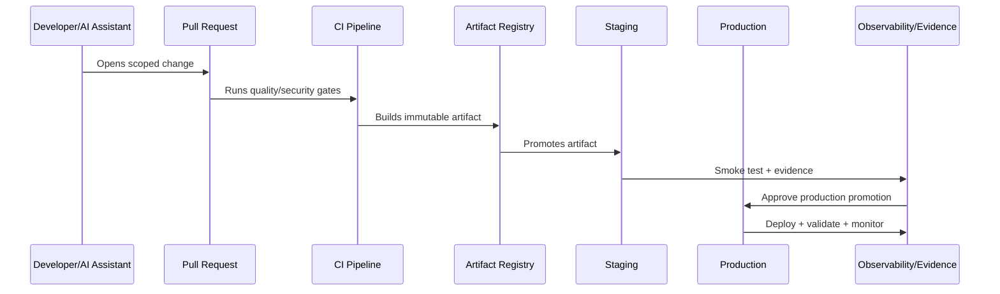

# Branching and Merge Strategy

> *"Defines branching, pull request, merge, code review, CODEOWNERS, protected branches, and release branch standards."*

---

# Purpose

Defines branching, pull request, merge, code review, CODEOWNERS, protected branches, and release branch standards.

---

# Delivery Problem

Uncontrolled branching and merging can bypass reviews, skip security checks, and make releases hard to trace.

---

# Delivery Decision

## Decision

CLARA should use a simple protected-branch workflow with required reviews, quality gates, ownership checks, and controlled release branching when needed.

## Status

Accepted.

---

# CI/CD Implementation Rule

Every CLARA production change should move through:

```text
Commit -> Pull Request -> Review -> CI Quality Gates -> Build Artifact -> Environment Promotion -> Deployment -> Smoke Validation -> Observability Check -> Evidence Capture
```

A delivery workflow is not production-ready if it cannot answer:

```text
who approved the change
what tests and scans passed
what artifact was built
what environment received it
what config/secrets were used
what migration ran
what feature flags changed
how deployment was validated
how rollback/forward-fix works
where audit evidence is stored
```

---

# Recommended Delivery Flow



---

# Production-Ready Checklist

- [ ] Branch protection exists.
- [ ] Required reviews exist.
- [ ] Quality gates block unsafe changes.
- [ ] Security scans run.
- [ ] Artifact is immutable and traceable.
- [ ] Environment promotion is explicit.
- [ ] Secrets are injected securely.
- [ ] Migrations are controlled.
- [ ] Feature flags are documented.
- [ ] Deployment strategy is selected.
- [ ] Rollback/hotfix path exists.
- [ ] Evidence is captured.

---

# Acceptance Criteria

- [ ] Delivery path is repeatable.
- [ ] Production changes are traceable.
- [ ] Pipeline blocks risky changes.
- [ ] Secrets are protected.
- [ ] Deployment and rollback are clear.
- [ ] Audit evidence is available.
- [ ] AI coding assistants can apply this safely.

---

# Anti-patterns

Avoid:

- Direct commits to protected branches.
- Manual production deploys with no evidence.
- Rebuilding artifacts separately per environment.
- CI logs that expose secrets.
- Migration execution without review.
- Feature flags with no owner or cleanup date.
- Rollbacks that do not consider database compatibility.
- Long-lived release branches with unmerged fixes.
- Pipeline credentials with broad production access.
- Non-blocking critical security gates.

---

# Related Documents

- ../PART-08-Testing-and-Quality-Implementation/README.md
- ../PART-05-Database-and-Migration-Implementation/README.md
- ../PART-06-AI-Gateway-and-Automation-Implementation/README.md
- ../../BOOK-06-Security-Governance-and-Compliance/BOOK-06-Master-Index/README.md
- ../../BOOK-07-Operations-Observability-and-Reliability/BOOK-07-Master-Index/README.md

---

# Navigation

**Previous:** `97-CI-CD-and-Environment-Implementation-Overview.md`

**Next:** `99-Pipeline-Structure-and-Quality-Gates.md`

---

# Recommended Branch Model

Use:

```text
main = protected, releasable branch
feature/* = short-lived feature branches
fix/* = short-lived bugfix branches
hotfix/* = emergency production fixes
release/* = optional controlled release branch
```

---

# Pull Request Rules

PRs should require:

```text
clear description
linked requirement/issue
small scope
tests updated
security impact noted
docs/runbook impact checked
review from CODEOWNERS where needed
passing quality gates
```

---

# Protected Branch Rules

Protect:

```text
main
release/*
production deployment branches/tags if used
```

Require:

```text
status checks
review approval
no force push
signed commits/tags where adopted
admin bypass restrictions
```

---

# Merge Rule

No production-bound code should merge without review and required gates.
