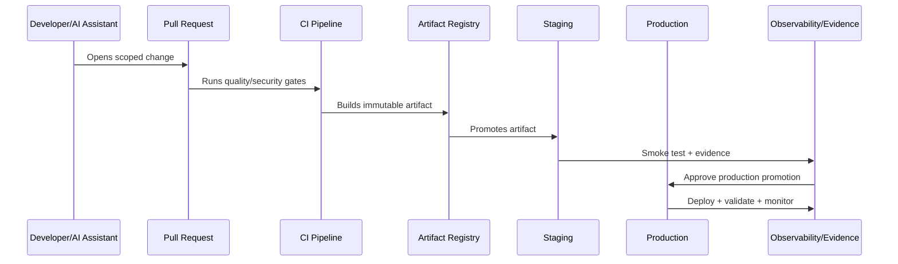

# Pipeline Structure and Quality Gates

> *"Defines CI pipeline stages, required checks, blocking quality gates, test selection, security scanning, and merge/release evidence."*

---

# Purpose

Defines CI pipeline stages, required checks, blocking quality gates, test selection, security scanning, and merge/release evidence.

---

# Delivery Problem

CI that only builds code without enforcing quality does not protect production.

---

# Delivery Decision

## Decision

CLARA pipelines should enforce format, lint, typecheck, tests, migration checks, security checks, build checks, and release-specific validation.

## Status

Accepted.

---

# CI/CD Implementation Rule

Every CLARA production change should move through:

```text
Commit -> Pull Request -> Review -> CI Quality Gates -> Build Artifact -> Environment Promotion -> Deployment -> Smoke Validation -> Observability Check -> Evidence Capture
```

A delivery workflow is not production-ready if it cannot answer:

```text
who approved the change
what tests and scans passed
what artifact was built
what environment received it
what config/secrets were used
what migration ran
what feature flags changed
how deployment was validated
how rollback/forward-fix works
where audit evidence is stored
```

---

# Recommended Delivery Flow



---

# Production-Ready Checklist

- [ ] Branch protection exists.
- [ ] Required reviews exist.
- [ ] Quality gates block unsafe changes.
- [ ] Security scans run.
- [ ] Artifact is immutable and traceable.
- [ ] Environment promotion is explicit.
- [ ] Secrets are injected securely.
- [ ] Migrations are controlled.
- [ ] Feature flags are documented.
- [ ] Deployment strategy is selected.
- [ ] Rollback/hotfix path exists.
- [ ] Evidence is captured.

---

# Acceptance Criteria

- [ ] Delivery path is repeatable.
- [ ] Production changes are traceable.
- [ ] Pipeline blocks risky changes.
- [ ] Secrets are protected.
- [ ] Deployment and rollback are clear.
- [ ] Audit evidence is available.
- [ ] AI coding assistants can apply this safely.

---

# Anti-patterns

Avoid:

- Direct commits to protected branches.
- Manual production deploys with no evidence.
- Rebuilding artifacts separately per environment.
- CI logs that expose secrets.
- Migration execution without review.
- Feature flags with no owner or cleanup date.
- Rollbacks that do not consider database compatibility.
- Long-lived release branches with unmerged fixes.
- Pipeline credentials with broad production access.
- Non-blocking critical security gates.

---

# Related Documents

- ../PART-08-Testing-and-Quality-Implementation/README.md
- ../PART-05-Database-and-Migration-Implementation/README.md
- ../PART-06-AI-Gateway-and-Automation-Implementation/README.md
- ../../BOOK-06-Security-Governance-and-Compliance/BOOK-06-Master-Index/README.md
- ../../BOOK-07-Operations-Observability-and-Reliability/BOOK-07-Master-Index/README.md

---

# Navigation

**Previous:** `98-Branching-and-Merge-Strategy.md`

**Next:** `100-Build-and-Artifact-Strategy.md`

---

# Pipeline Stages

Recommended stages:

```text
setup
dependency install
format
lint
typecheck
unit tests
integration tests
contract tests
migration check
security scan
secret scan
build
artifact publish
deployment validation
```

---

# Required Gates

Block merge on:

```text
failed build
failed required tests
failed typecheck
failed lint where configured as required
detected secret
critical/high vulnerability above policy threshold
migration validation failure
contract breaking change without approval
```

---

# Evidence Output

Pipeline should record:

```text
commit SHA
PR number
artifact ID
test results
scan results
migration check result
build logs
approval records
deployment target
```

---

# Quality Gate Rule

If a gate protects production-critical behavior, it must be blocking.
