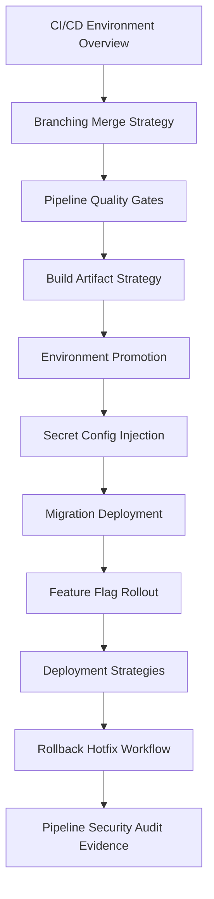

# PART-09 — CI/CD and Environment Implementation

> *"CI/CD is the production control plane for code. Treat it like critical infrastructure."*

---

# Purpose

Part 09 defines CLARA's CI/CD and environment implementation standards.

It covers:

- CI/CD and Environment Implementation overview.
- Branching and Merge Strategy.
- Pipeline Structure and Quality Gates.
- Build and Artifact Strategy.
- Environment Promotion Workflow.
- Secret and Configuration Injection.
- Migration Deployment Workflow.
- Feature Flag and Rollout Implementation.
- Deployment Strategies.
- Rollback and Hotfix Workflow.
- Pipeline Security and Audit Evidence.
- Part 09 Summary.

---

# Chapter Map

| Chapter | Title |
|---:|---|
| 97 | CI/CD and Environment Implementation Overview |
| 98 | Branching and Merge Strategy |
| 99 | Pipeline Structure and Quality Gates |
| 100 | Build and Artifact Strategy |
| 101 | Environment Promotion Workflow |
| 102 | Secret and Configuration Injection |
| 103 | Migration Deployment Workflow |
| 104 | Feature Flag and Rollout Implementation |
| 105 | Deployment Strategies |
| 106 | Rollback and Hotfix Workflow |
| 107 | Pipeline Security and Audit Evidence |
| 108 | Part 09 Summary |

---

# CI/CD Implementation Map



---

# CI/CD Non-Negotiables

CLARA CI/CD implementation must enforce:

```text
protected branches
required reviews
CODEOWNERS for critical areas
required quality gates
security scanning
secret scanning
immutable artifacts
environment isolation
controlled secret injection
migration safety checks
feature flag ownership
safe deployment strategy
rollback/hotfix path
pipeline audit evidence
least-privilege CI/CD access
```

---

# Relationship to Previous Parts

Part 08 defines testing and quality implementation.

Part 09 wires quality into real CI/CD pipelines and deployment environments.

---

# Navigation

**Previous:** `../PART-08-Testing-and-Quality-Implementation/96-Part-08-Summary.md`

**Next:** `97-CI-CD-and-Environment-Implementation-Overview.md`
