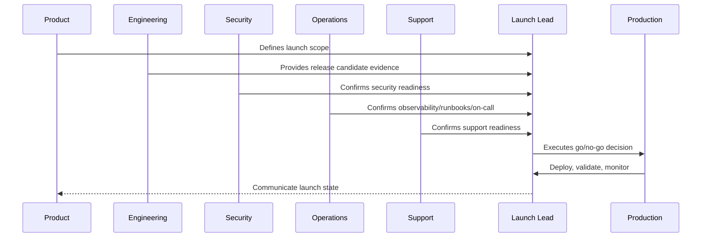

# Launch Readiness Criteria

> *"Defines the minimum launch readiness criteria across product, engineering, security, data, operations, support, performance, observability, and compliance."*

---

# Purpose

Defines the minimum launch readiness criteria across product, engineering, security, data, operations, support, performance, observability, and compliance.

---

# Launch Problem

Without readiness criteria, launch decisions become subjective and pressure-driven.

---

# Launch Decision

## Decision

CLARA should launch only when launch readiness criteria are met or explicitly accepted as known risks with owners and mitigations.

## Status

Accepted.

---

# Production Launch Rule

Every CLARA production launch should move through:

```text
Scope Definition -> Release Candidate -> Readiness Review -> Go/No-Go -> Deployment -> Smoke Validation -> Monitoring Window -> Stabilization Review -> Post-Launch Follow-Up
```

A launch is not production-ready if it cannot answer:

```text
what is being launched
who owns launch execution
what is intentionally excluded
what risks are known
what readiness evidence exists
what customer impact is expected
what monitoring will be watched
what rollback triggers exist
who communicates status
who handles support escalation
what happens after launch
```

---

# Recommended Launch Flow



---

# Production-Ready Checklist

- [ ] Launch scope is documented.
- [ ] Release candidate is identified.
- [ ] Go/no-go criteria are defined.
- [ ] Security readiness is checked.
- [ ] Operations readiness is checked.
- [ ] Support readiness is checked.
- [ ] Data/migration readiness is checked.
- [ ] Integration readiness is checked.
- [ ] AI/automation readiness is checked.
- [ ] Smoke tests are defined.
- [ ] Rollback triggers are defined.
- [ ] Launch communication owner is assigned.
- [ ] Post-launch monitoring window is scheduled.

---

# Acceptance Criteria

- [ ] Launch plan is actionable.
- [ ] Owners are assigned.
- [ ] Readiness evidence is captured.
- [ ] Risks are visible.
- [ ] Rollback/mitigation is understood.
- [ ] Monitoring and support are ready.
- [ ] AI coding assistants can apply this safely.

---

# Anti-patterns

Avoid:

- Launching with unclear scope.
- Adding features during launch freeze.
- No go/no-go decision owner.
- No rollback criteria.
- No support playbook.
- No on-call coverage.
- No migration validation.
- No integration production verification.
- No AI kill switch.
- No launch monitoring dashboard.
- Relying on chat messages as launch evidence.

---

# Related Documents

- ../PART-09-CI-CD-and-Environment-Implementation/README.md
- ../PART-08-Testing-and-Quality-Implementation/README.md
- ../../BOOK-06-Security-Governance-and-Compliance/BOOK-06-Master-Index/README.md
- ../../BOOK-07-Operations-Observability-and-Reliability/BOOK-07-Master-Index/README.md
- ../../BOOK-07-Operations-Observability-and-Reliability/PART-09-Runbooks-and-Playbooks/README.md

---

# Navigation

**Previous:** `109-Production-Launch-Plan-Overview.md`

**Next:** `111-Launch-Scope-and-Release-Candidate.md`

---

# Launch Readiness Categories

Readiness must cover:

```text
product readiness
engineering readiness
quality readiness
security readiness
compliance readiness
operations readiness
support readiness
data readiness
integration readiness
AI/automation readiness
communication readiness
```

---

# Go/No-Go Criteria

Example go criteria:

```text
release candidate validated
critical tests passing
no open launch-blocker vulnerabilities
migrations tested
dashboards and alerts ready
on-call scheduled
support playbook ready
rollback path known
launch communication prepared
```

No-go examples:

```text
critical authz bug
unverified migration
missing backup
broken core workflow
missing on-call
AI feature has no kill switch
webhook signature verification broken
```

---

# Readiness Rule

Known risks may be accepted only with owner, mitigation, customer impact assessment, and review evidence.
